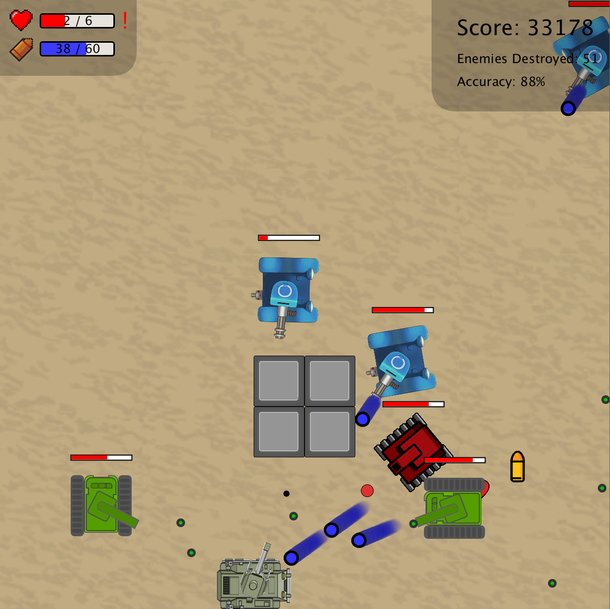

# Bullet-Dodging Game in Processing

Processing is an open-source graphical library written in Java. Designed for the visual arts community, Processing can be used to create interactive graphics such as data visualizations, digital art, and video games. In this blog, we're going to build a simple bullet-dodging game from scratch using Processing. All of the built-in functions mentioned below can be found on the [Processing reference page](https://processing.org/reference/).


## Table of contents:

* [Part I: Getting Started](#part-i:-getting-started)
* [Part II: Adding the Player and the Bullets](#part-ii:-adding-the-player-and-the-bullets)

* [Part III: Adding a Life and Scoring System](#part-iii:-adding-a-life-and-scoring-system)

* [Part IV: Adding Enemies and Shooting](#part-iv:-adding-enemies-and-shooting)

* [Part V: Implementing More Subclasses](#part-v:-implementing-more-subclasses)

* [Part VI: Adding Images](#part-vi:-adding-images)

* [Part VII: Adding Obstacles](#part-vii:-adding-obstacles)

* [Part VIII: Pausing and Restarting the Game](#part-viii:-pausing-and-restarting-the-game)


## Part I: Getting Started

The Processing Development Environment (PDE) can be downloaded from [here](https://processing.org/download/).

After launching the editor, you will see a text editor, a compiler, and a display window. Programs are written in the text editor and started by pressing the Run button.

The program runs by automatically calling two special functions: `setup()` and `draw()`. Let's first write the following two lines in the editor:

```
void setup() {}

void draw() {}

```

The `setup()` function is run once, when the program starts, so it's where we initialize the canvas and variables. After running the `setup()` function, the code inside `draw()` will run continuously from top to bottom until the program is stopped. Let's write down the two function names first.

If we run the current program by pressing the Run button on the upper left corner (or Ctrl + R), a small canvas with the default size will appear.


Now, it's time to write some stuff in the above functions. We can use `size()` and `background()` to set up the size and color of our canvas. The `size()` function takes two arguments—width and height, whereas the `background()` function can take either RGB or the gray parameter (0-255, where 0 means black and 255 means white) depending on the number of arguments. Since the canvas size will stay the same, we should put `size()` in the `setup()` function. On the other hand, since we will clear the contents of the window and redraw the screen each time `draw()` is called, `background()` should be put at the beginning of the `draw()` function.


## Part II: Adding the Player and the Bullets

Now that the canvas has been set up, let's add the player on the screen. For simplicity, let's temporarily represent the player using `circle()`.

We can define a Player class with two functions—`update()` and `show()`. `update()` moves the player's position when the user presses the arrow keys and the `constrain()` function in it keeps the player within bounds; `show()` draws a circle to show the player's current position.

```
class Player {
  int size = 100;
  int xpos = int(random(size, width - size));
  int ypos = 1000;
  
  void update() {
    if (keyPressed) {
      if (keyCode == LEFT) {
        xpos -= 10;
      } else if (keyCode == RIGHT) {
        xpos += 10;
      } else if (keyCode == UP) {
        ypos -= 10;
      } else if (keyCode == DOWN) {
        ypos += 10;
      }
    }
    // prevent the player from moving off-screen
    xpos = constrain(xpos, size / 2, width - size / 2);
  }

  void show() {
    fill(0);  // filled with black
    circle(xpos, ypos, size);
  }
}
```

We can now declare an instance `Player player;` at the top of the code as a global variable and initialize it in `setup()`: `  player = new Player();`. Then by calling `player.update();player.show();` in `draw()`, we should be able to control the player's movement now.


Likewise, we can also define a Bullet class with functions `update()`, `show()` and `check_collision()`. The bullets will drop from top to bottom (vertical position increases from 0 to height) at a speed of 5 and at the same time will check if they have hit the player.

```
class Bullet {
  int size = 10;
  int xpos = int(random(size, width - size));
  int ypos;
  
  Bullet(int ypos) {
    this.ypos = ypos;
  }

  void update() {
    ypos += 5;
    if (ypos > height + size / 2) {  // reuse the bullets
      xpos = int(random(size, width - size));
      ypos = - size / 2;
    }
  }

  void show() {
    fill(255);
    stroke(255, 0, 0);
    strokeWeight(5);
    circle(xpos, ypos, size);
    noStroke();
  }

  boolean check_collision() {
    if (dist(xpos, ypos, player.xpos, player.ypos) < (size + player.size) / 2) {
      return true;
    }
    return false;
  }
}
```

We can now declare an array of Bullet at the top of the code as global variables:

```
int MAX_BULLET = 25;
Bullet bullets[] = new Bullet[MAX_BULLET];
```

Let's initialize the bullets with varying initial vertical positions in `setup()`:

```
for (int i = 0; i < MAX_BULLET; i++) {
  bullets[i] = new Bullet(- i * height / MAX_BULLET);
}
```

Then we can call `update()`, `show()` and `check_collision()` in `draw()`:

```
for (int i = 0; i < MAX_BULLET; i++) {
  bullets[i].update();
  bullets[i].show();
  if (bullets[i].check_collision()) {
    exit();
  }
}
```

We haven't dealt with the case when the bullet hits the player, but at least we already have a rather primitive version of the game to play now.


## Part III: Adding a Life and Scoring System

Perhaps we should allow the player to have multiple chances in our game, otherwise the game tends to end to fast. So let's add a life system to make the game more enjoyable.

To start, [here](https://github.com/Bowen1Zhu/Bullet-Dodging-Game/blob/master/data/heart1.png) & [here](https://github.com/Bowen1Zhu/Bullet-Dodging-Game/blob/master/data/heart2.png) are the heart icons that I used in the life system. To add an image to the program, simply drag it into the Processing editor, and when you save the project, a data folder containing the image will automatically appear in the project folder next to the Processing code file.

To load the image in the program, first declare

```
PImage heart1;
PImage heart2;
```

at the top of the code, and then call `loadImage()` in `setup()`:

```
heart1 = loadImage("heart1.png");
heart2 = loadImage("heart2.png");
```

Then we can draw the images at the specified position (upper left corner) by calling the`image()` function: `image(heart1, 20, 19, 45, 45);`.


Next, we will draw a hitpoint bar next to the icon. After declaring relevant variables at the top:

```
int MAX_HP = 6;
int hp = 6;
```

and add the following lines of actions when `bullets[i].check_collision()` returns true:

```
hp --;
bullets[i].ypos = - bullets[i].size;
if (hp == 0) {
  exit();
}
```

we can manually draw the bar in `draw()`:

```
fill(255);
stroke(0);
strokeWeight(3);
rect(80, 28, 145, 27, 5);
fill(255, 0, 0);
noStroke();
rect(82, 30, 142 * hp / MAX_HP, 24, 3);
fill(0);
strokeWeight(5);
textSize(24);
text(hp + " / 6", 125, 50);
```


Now that the player has multiple lives, we can also enable the player to collect extra lives during the game.

We define the Life class below:

```
class Life {
  int size = 60;  // size of the icon
  float xpos = random(size / 2, width - size / 2);  // randomize horizontal position of the icon
  float ypos = random(size / 2, height - size / 2); // randomize vertical position of the icon

  // draw the icon
  void show() {
    image(heart2, xpos, ypos, size, size);
  }

  // increment hp and return true if the player has touched the icon
  boolean check_collision() {
    if (dist(xpos, ypos, player.xpos, player.ypos) < (size + player.size) / 2) {
      if (hp < MAX_HP) {
        hp ++;
      }
      return true;  //return true so that the icon will be reinitialized
    }
    return false;
  }
}
```

Again we declare `Life life;` at the top, initialize the object `life = new Life();` in `setup()`, and check for collision in `draw()`:

```
life.show();
if (life.check_collision()) {
  life = new Life();
}
```


With the life system, it is natural to add a scoring system as well. Simply declare a score variable `int score = 0;` at the top, and at the end of the draw function increment the variable `  score ++;`. We can show the player's score at the top right corner of the screen: `text("Score: " + score, 1000, 50);`.


Our game looks more exciting now!


Here's our code so far:

```
PImage heart1;
PImage heart2;

Player player;
Life life;

int MAX_BULLET = 25;
Bullet bullets[] = new Bullet[MAX_BULLET];
int MAX_HP = 6;
int hp = 6;
int score = 0;

class Player {
  int size = 100;
  int xpos = int(random(size, width - size));
  int ypos = 1000;
  
  void update() {
    if (keyPressed) {
      if (keyCode == LEFT) {
        xpos -= 10;
      } else if (keyCode == RIGHT) {
        xpos += 10;
      } else if (keyCode == UP) {
        ypos -= 10;
      } else if (keyCode == DOWN) {
        ypos += 10;
      }
    }
    // prevent the player from moving off-screen
    xpos = constrain(xpos, size / 2, width - size / 2);
  }

  void show() {
    fill(0);  // filled with black
    circle(xpos, ypos, size);
  }
}

class Bullet {
  int size = 10;
  int xpos = int(random(size, width - size));
  int ypos;
  
  Bullet(int ypos) {
    this.ypos = ypos;
  }

  void update() {
    ypos += 5;
    if (ypos > height + size / 2) {  // reuse the bullets
      xpos = int(random(size, width - size));
      ypos = - size / 2;
    }
  }

  void show() {
    fill(255);
    stroke(255, 0, 0);
    strokeWeight(5);
    circle(xpos, ypos, size);
    noStroke();
  }

  boolean check_collision() {
    if (dist(xpos, ypos, player.xpos, player.ypos) < (size + player.size) / 2) {
      return true;
    }
    return false;
  }
}

class Life {
  int size = 60;  // size of the icon
  float xpos = random(size / 2, width - size / 2);  // randomize horizontal position of the icon
  float ypos = random(size / 2, height - size / 2); // randomize vertical position of the icon

  // draw the icon
  void show() {
    image(heart2, xpos, ypos, size, size);
  }

  // increment hp and return true if the player has touched the icon
  boolean check_collision() {
    if (dist(xpos, ypos, player.xpos, player.ypos) < (size + player.size) / 2) {
      if (hp < MAX_HP) {
        hp ++;
      }
      return true;  //return true so that the icon will be reinitialized
    }
    return false;
  }
}

void setup() {
  size(1200, 1200);  // 1200 x 1200 canvas size
  heart1 = loadImage("heart1.png");
  heart2 = loadImage("heart2.png");
  player = new Player();
  life = new Life();
  for (int i = 0; i < MAX_BULLET; i++) {
    bullets[i] = new Bullet(- i * height / MAX_BULLET);
  }
}

void draw() {
  background(255);      // white background
  player.update();
  player.show();
  for (int i = 0; i < MAX_BULLET; i++) {
    bullets[i].update();
    bullets[i].show();
    if (bullets[i].check_collision()) {
      hp --;
      bullets[i].ypos = - bullets[i].size;
      if (hp == 0) {
        exit();
      }
    }
  }
  life.show();
  if (life.check_collision()) {
    life = new Life();
  }
  show_status();
  score ++;
}

void show_status() {
  fill(255);
  stroke(0);
  strokeWeight(3);
  rect(80, 28, 145, 27, 5);
  image(heart1, 20, 19, 45, 45);
  fill(255, 0, 0);
  noStroke();
  rect(82, 30, 142 * hp / MAX_HP, 24, 3);
  fill(0);
  strokeWeight(5);
  textSize(24);
  text(hp + " / 6", 125, 50);  
  text("Score: " + score, 1000, 50);
}
```


## Part IV: Adding Enemies and Shooting

We have already implemented all the essential functions of a simple bullet-dodging game. If you're ready for a more advanced program, it is now time to add enemies to the game and make it a shooting game.

First of all, it is important for us to declare a global time variable `int time = 0;` and increment it (`time ++;`) at the end of `draw()`, so that we can decide when the enemy will fire the next bullet regularly.

We would like to have different kinds of enemies shooting different kinds of bullets, so we will abandon our previous Bullet class as well as the bullet array. Instead, let's first define the following two abstract classes—Bullet and Enemy—which requires support for the basic functions such as `update()` and `show()`. Each subclass will have its own attributes—size, speed, etc.

```
abstract class Bullet {
  int size, speed, damage;
  float xpos, ypos, xspeed, yspeed;

  // decrement hp and return true if the bullet hits the player
  boolean check_collision() {
    if (dist(xpos, ypos, player.xpos, player.ypos) < player.size / 2) {
      hp -= damage;
      return true;
    }
    return false;
  }

  abstract boolean update();  // update the position of the bullet
  abstract void show();  // draw the bullet on the screen
}

abstract class Enemy {
  int size, speed, max_hp, hp, appear_time = time;
  float xpos, ypos;
  
  // draw the hp bar above the enemy
  void show_hp() {
    fill(255);
    stroke(0);
    strokeWeight(2);
    rect(xpos - 60, ypos - 100, 120, 10);  // total hit points
    noStroke();
    fill(255, 0, 0);
    rect(xpos - 59, ypos - 99, 119 * hp / max_hp, 8); // remaining hit points
  }

  abstract void update();  // update the position of the bullet
  abstract void show();    // draw the enemy on the screen
  abstract void shoot();   // fire a bullet
}
```

Abstract classes cannot be instantiated, but we are able to create ArrayLists that hold objects of their subclasses:

```
import java.util.List; 
import java.util.ArrayList; 
import java.util.Iterator;

List<Bullet> my_bullets = new ArrayList<Bullet>();
List<Bullet> bullets = new ArrayList<Bullet>();
List<Enemy> enemies = new ArrayList<Enemy>();
```

Next, let's implement a simple subclass of Enemy along with its Bullet. This particular enemy will move around the screen in counterclockwise direction starting from the upper right:

```
class Green_Enemy extends Enemy {
  int dist = 200;  // margin between its path and the boundary of the arena
  int pos = 3;  // position of the enemy: 0--right; 1--bottom; 2--left; 3--top
  Green_Enemy() {
    size = 120;  // size of the enemy
    speed = 5;   // velocity of the enemy
    max_hp = 5;  // total hit points
    hp = 5;      // current hit points
    xpos = width + size / 2;  // horizontal position of the enemy
    ypos = dist;              // vertical position of the enemy
  }

  // the enemy moves in counterclockwise direction, starting from the upper right
  void update() {
    if (pos == 3) {         // top
      xpos -= speed;        // move leftward
      if (xpos <= dist) {
        pos = 2;            // turn left at the upper left corner
      }
    } else if (pos == 2) {  // left
      ypos += speed;        // move downward
      if (ypos >= height - dist) {
        pos = 1;            // turn left at the lower left corner
      }
    } else if (pos == 1) {  // bottom
      xpos += speed;        // move rightward
      if (xpos >= width - dist) {
        pos = 0;            // turn left at the lower right corner
      }
    } else {                // right
      ypos -= speed;        // move upward
      if (ypos <= dist) {
        pos = 3;            // turn left at the upper right corner
      }
    }

    if ((time - appear_time) % 30 == 0) {
      shoot();  // fire a bullet 
    }
  }

  // draw the enemy on the screen
  void show() {
    fill(255, 0, 0);
    stroke(0);
    strokeWeight(5);
    circle(xpos, ypos, size);
    noStroke();
    show_hp();
  }

  // fire a bullet
  void shoot() {
    bullets.add(new Red_Bullet(xpos, ypos));
  }
}
```

This enemy will fire a particular kind of bullet towards the player:

```
class Green_Bullet extends Bullet {
  Green_Bullet(float xpos, float ypos) {
    size = 12;  // size of the bullet
    speed = 6;  // total velocity of the bullet
    damage = 1;  // damage of the bullet
    this.xpos = xpos;  // horizontal position of the bullet
    this.ypos = ypos;  // vertical position of the bullet
    // calculate the horizontal and vertical speed of the bullet
    float x_dist = player.xpos - xpos;
    float y_dist = player.ypos - ypos;
    xspeed = speed * x_dist / dist(xpos, ypos, player.xpos, player.ypos);
    yspeed = speed * y_dist / dist(xpos, ypos, player.xpos, player.ypos);
  }

  // update the position of the bullet
  boolean update() {
    xpos += xspeed;
    ypos += yspeed;
    // return true if the bullet hits the boundary
    if (xpos < - size / 2 || xpos > width + size / 2 || ypos < - size / 2 || ypos > height + size / 2) {
      return true;
    }
    return false;
  }
  
  // draw the bullet on the screen
  void show() {
    fill(0, 200, 0);
    stroke(50);
    strokeWeight(5);
    circle(xpos, ypos, size);
    noStroke();
  }
}
```


Since we are using ArrayList now, the code for updating enemies and bullets in `draw()` becomes the following:

```
// create a new enemy after a certain time interval
if (time % 800 == 0) {
  enemies.add(new Green_Enemy());
}
// update and draw all the existing bullets shot by the enemies; remove the bullet that has hit the player, the boundary
Iterator itr = bullets.iterator();
while (itr.hasNext()) {
  Bullet b = (Bullet)itr.next();
  if (b.update()) {
    itr.remove();
  } else {
    b.show();
    if (b.check_collision()) {
      itr.remove();
      if (hp == 0) {
        exit();
      }
    }
  }
}
// update and draw all the existing enemies
itr = enemies.iterator(); 
while (itr.hasNext()) {
  Enemy e = (Enemy)itr.next();
  e.update();
  e.show();
}
```


Now that we have let the enemies fire bullets towards the player, it would be unfair if the player cannot shoot back. So let's implement the player's bullet as well to make it a shooting game:

```
class My_Bullet extends Bullet {
  My_Bullet(float xpos, float ypos) {
    size = 12;  // size of the bullet
    speed = 10;  // total velocity of the bullet
    damage = 1;  // damage of the bullet
    this.xpos = xpos;  // horizontal position of the bullet
    this.ypos = ypos;  // vertical position of the bullet
    // calculate the horizontal and vertical speed of the bullet
    float x_dist = mouseX - player.xpos;
    float y_dist = mouseY - player.ypos;
    xspeed = speed * x_dist / dist(player.xpos, player.ypos, mouseX, mouseY);
    yspeed = speed * y_dist / dist(player.xpos, player.ypos, mouseX, mouseY);
  }

  // update the position of the bullet
  boolean update() {
    xpos += xspeed;
    ypos += yspeed;
    // return true if the bullet hits the boundary
    if (xpos < - size / 2 || xpos > width + size / 2 || ypos < - size / 2 || ypos > height + size / 2) {
      return true;
    }
    return false;
  }

  // draw the bullet on the screen
  void show() {
    fill(0);
    circle(xpos, ypos, size);
  }

  // check if the player's bullet has hit any enemy
  boolean check_hit() {
    // traverse the enemy array
    Iterator itr = enemies.iterator();
    while (itr.hasNext()) {
      Enemy e = (Enemy)itr.next();
      // if the bullet touches an enemy, decrement its hp, increment the number of bullets that hit the target
      if (dist(xpos, ypos, e.xpos, e.ypos) < (size + e.size) / 2) {
        e.hp --;
        // if the enemy's hp is reduced to zero, remove it from the array, increment the score and the number of enemies destroyed
        if (e.hp == 0) {
          score += 500;
          itr.remove();
        }
        return true;  // return true so that the bullet will be removed from the bullet array
      }
    }
    return false;
  }
}
```

Similar to the bullets and enemies array, we need to iterate through the my_bullet array in `draw()` to update the player's bullets:

```
// update and draw all the existing bullets shot by the player; remove the bullet that has hit the enemies or the boundary
itr = my_bullets.iterator();
while (itr.hasNext()) {
  My_Bullet b = (My_Bullet)itr.next(); 
  if (b.update()) {
    itr.remove();
  } else {
    b.show();
    if (b.check_hit()) {
      itr.remove();
    }
  }
}
```

To shoot a bullet, we first need to add a `shoot()` function to the Player class:

```
void shoot() {
  my_bullets.add(new My_Bullet(xpos, ypos));
}
```

Finally, we need to utilize the `MousePressed()` function, which is called once after every time a mouse button is pressed. By calling `player.shoot()` in `mousePressed()`, a bullet will be shot towards the position of the cursor whenever the player presses the mouse.

```
// the player fires a bullet when the mouse is pressed
void mousePressed() {
  player.shoot();
}
```


## Part V: Implementing More Subclasses

In the previous section, we have improved our bullet-dodging game and made it more like a shooting game. Likewise, you may use your imagination to create all kinds of enemies and bullets. For example, in the code below I also implemented enemies that follow the player and shoot bouncing bullets, and enemies that head slowly towards a fixed position and shoot homing bullets.

```
import java.util.List; 
import java.util.ArrayList; 
import java.util.Iterator;

List<Bullet> my_bullets = new ArrayList<Bullet>();
List<Bullet> bullets = new ArrayList<Bullet>();
List<Enemy> enemies = new ArrayList<Enemy>();

PImage heart1;
PImage heart2;

Player player;
Life life;

int MAX_HP = 6;     // total hit points
int hp = 6;         // remaining hit points
int score = 0;      // current score
int time = 0;       // time elapsed
int last_time = 0;  // time when the last enemy appears

class Player {
  int size = 100;
  int xpos = int(random(size, width - size));
  int ypos = 1000;
  
  void update() {
    if (keyPressed) {
      if (keyCode == LEFT) {
        xpos -= 10;
      } else if (keyCode == RIGHT) {
        xpos += 10;
      } else if (keyCode == UP) {
        ypos -= 10;
      } else if (keyCode == DOWN) {
        ypos += 10;
      }
    }
    // prevent the player from moving off-screen
    xpos = constrain(xpos, size / 2, width - size / 2);
    ypos = constrain(ypos, size / 2, height - size / 2);
  }

  void show() {
    fill(0);  // filled with black
    circle(xpos, ypos, size);
  }
  
  void shoot() {
    my_bullets.add(new My_Bullet(xpos, ypos));
  }
}

abstract class Bullet {
  int size, speed, damage;
  float xpos, ypos, xspeed, yspeed;

  // decrement hp and return true if the bullet hits the player
  boolean check_collision() {
    if (dist(xpos, ypos, player.xpos, player.ypos) < player.size / 2) {
      hp -= damage;
      return true;
    }
    return false;
  }

  abstract boolean update();  // update the position of the bullet
  abstract void show();  // draw the bullet on the screen
}

// player's bullet
class My_Bullet extends Bullet {
  My_Bullet(float xpos, float ypos) {
    size = 12;  // size of the bullet
    speed = 10;  // total velocity of the bullet
    damage = 1;  // damage of the bullet
    this.xpos = xpos;  // horizontal position of the bullet
    this.ypos = ypos;  // vertical position of the bullet
    // calculate the horizontal and vertical speed of the bullet
    float x_dist = mouseX - player.xpos;
    float y_dist = mouseY - player.ypos;
    xspeed = speed * x_dist / dist(player.xpos, player.ypos, mouseX, mouseY);
    yspeed = speed * y_dist / dist(player.xpos, player.ypos, mouseX, mouseY);
  }

  // update the position of the bullet
  boolean update() {
    xpos += xspeed;
    ypos += yspeed;
    // return true if the bullet hits the boundary
    if (xpos < - size / 2 || xpos > width + size / 2 || ypos < - size / 2 || ypos > height + size / 2) {
      return true;
    }
    return false;
  }

  // draw the bullet on the screen
  void show() {
    fill(0);
    circle(xpos, ypos, size);
  }

  // check if the player's bullet has hit any enemy
  boolean check_hit() {
    // traverse the enemy array
    Iterator itr = enemies.iterator();
    while (itr.hasNext()) {
      Enemy e = (Enemy)itr.next();
      // if the bullet touches an enemy, decrement its hp, increment the number of bullets that hit the target
      if (dist(xpos, ypos, e.xpos, e.ypos) < (size + e.size) / 2) {
        e.hp --;
        // if the enemy's hp is reduced to zero, remove it from the array, increment the score and the number of enemies destroyed
        if (e.hp == 0) {
          if (e.max_hp == 5) {
            score += 500;
          } else if (e.max_hp == 4) {
            score += 750;
          } else {
            score += 1000;
          }
          itr.remove();
        }
        return true;  // return true so that the bullet will be removed from the bullet array
      }
    }
    return false;
  }
}

// green bullet with no special effect and little damage
class Green_Bullet extends Bullet {
  Green_Bullet(float xpos, float ypos) {
    size = 12;  // size of the bullet
    speed = 6;  // total velocity of the bullet
    damage = 1;  // damage of the bullet
    this.xpos = xpos;  // horizontal position of the bullet
    this.ypos = ypos;  // vertical position of the bullet
    // calculate the horizontal and vertical speed of the bullet
    float x_dist = player.xpos - xpos;
    float y_dist = player.ypos - ypos;
    xspeed = speed * x_dist / dist(xpos, ypos, player.xpos, player.ypos);
    yspeed = speed * y_dist / dist(xpos, ypos, player.xpos, player.ypos);
  }

  // update the position of the bullet
  boolean update() {
    xpos += xspeed;
    ypos += yspeed;
    // return true if the bullet hits the boundary
    if (xpos < - size / 2 || xpos > width + size / 2 || ypos < - size / 2 || ypos > height + size / 2) {
      return true;
    }
    return false;
  }
  
  // draw the bullet on the screen
  void show() {
    fill(0, 200, 0);
    stroke(50);
    strokeWeight(5);
    circle(xpos, ypos, size);
    noStroke();
  }
}

// bouncing bullet
class Red_Bullet extends Bullet {
  boolean bounced = false;  // whether the bullet has touched any wall once
  Red_Bullet(float xpos, float ypos) {
    size = 24;  // size of the bullet
    speed = 8;  // total velocity of the bullet
    damage = 2;  // damage of the bullet
    this.xpos = xpos;  // horizontal position of the bullet
    this.ypos = ypos;  // vertical position of the bullet
    // calculate the horizontal and vertical speed of the bullet
    float x_dist = player.xpos - xpos;
    float y_dist = player.ypos - ypos;
    xspeed = speed * x_dist / dist(xpos, ypos, player.xpos, player.ypos);
    yspeed = speed * y_dist / dist(xpos, ypos, player.xpos, player.ypos);
  }

  // update the position of the bullet
  boolean update() {
    xpos += xspeed;
    ypos += yspeed;
    // if the bullet hits the boundary or the obstacle
    if (xpos <= size / 2 || xpos >= width - size / 2) {  // left & right boundary
      if (bounced == false) {  // if the bullet hasn't bounced, reverse the horizontal velocity and mark it as bounced
        bounced = true;
        xspeed = - xspeed;
      } else {
        return true;  // return true if the bullet has bounced once and hit the boundary again
      }
    } else if (ypos <= size / 2 || ypos >= height - size / 2) {  // upper & lower boundary
      if (bounced == false) {  // if the bullet hasn't bounced, reverse the vertical velocity and mark it as bounced
        bounced = true;
        yspeed = - yspeed;
      } else {
        return true;  // return true if the bullet has bounced once and hit the boundary again
      }
    }
    return false;
  }
  
  // draw the bullet on the screen
  void show() {
    stroke(0);
    strokeWeight(1);
    fill(220, 50, 50);
    circle(xpos, ypos, size);
    noStroke();
  }
}

// homing bullet
class Blue_Bullet extends Bullet {
  int remaining_time = 300;  // the remaining time before the bullet disappears
  List<Path> path = new ArrayList<Path>();  // the trajectory of the bullet
  Blue_Bullet(float xpos, float ypos) {
    size = 25;  // size of the bullet
    speed = 4;  // total velocity of the bullet
    damage = 2;  // damage of the bullet
    this.xpos = xpos;  // horizontal position of the bullet
    this.ypos = ypos;  // vertical position of the bullet
  }

  boolean update() {
    remaining_time --;  // decrement the remaining time
    // return true if the time reduces to zero so that the bullet will be removed from the bullet array
    if (remaining_time == 0) {
      return true;
    } else if (remaining_time > 75) {
      // update the horizontal and vertical speed of the bullet
      float x_dist = player.xpos - xpos;
      float y_dist = player.ypos - ypos;
      xspeed = speed * x_dist / dist(xpos, ypos, player.xpos, player.ypos);
      yspeed = speed * y_dist / dist(xpos, ypos, player.xpos, player.ypos);
    }
    xpos += xspeed;
    ypos += yspeed;
    // update the trajectory of the bullet
    path.add(new Path(xpos, ypos));
    update_path();
    // return true if the bullet hits the boundary (seems impossible)
    if (xpos < - size / 2 || xpos > width + size / 2 || ypos < - size / 2 || ypos > height + size / 2) {
      return true;
    }
    return false;
  }

  // draw the bullet on the screen
  void show() {
    fill(50, 50, 255);
    stroke(0);
    strokeWeight(5);
    circle(xpos, ypos, size);
    noStroke();
  }
  
  // update the trajectory of the bullet
  void update_path() {
    Iterator itr = path.iterator();
    while (itr.hasNext()) {
      Path p = (Path)itr.next();
      p.update();
      p.show();
      // remove the object if it has become transparent
      if (p.alpha == 0) {
          itr.remove();
      }
    }
  }
}

// the trajectory of the homing bullet
class Path {
  float xpos, ypos;
  int size = 25, alpha = 255;
  Path(float xpos, float ypos) {
    this.xpos = xpos;
    this.ypos = ypos;
  }
  
  // the path will gradually become transparent
  void update() {
    alpha -= 12;
  }
  
  void show() {
    fill(0, 0, 200, alpha);
    stroke(50, 50, 150, alpha);
    strokeWeight(5);
    circle(xpos, ypos, size);
    noStroke();
  }
}

abstract class Enemy {
  int size, speed, max_hp, hp, appear_time = time;
  float xpos, ypos;
  
  // draw the hp bar above the enemy
  void show_hp() {
    fill(255);
    stroke(0);
    strokeWeight(2);
    rect(xpos - 60, ypos - 100, 120, 10);  // total hit points
    noStroke();
    fill(255, 0, 0);
    rect(xpos - 59, ypos - 99, 119 * hp / max_hp, 8); // remaining hit points
  }

  abstract void update();  // update the position of the bullet
  abstract void show();    // draw the enemy on the screen
  abstract void shoot();   // fire a bullet
}

// fast enemy moving around the arena
class Green_Enemy extends Enemy {
  int dist = 200;  // margin between its path and the boundary of the arena
  int pos = 3;  // position of the enemy: 0--right; 1--bottom; 2--left; 3--top
  Green_Enemy() {
    size = 120;  // size of the enemy
    speed = 5;   // velocity of the enemy
    max_hp = 5;  // total hit points
    hp = 5;      // current hit points
    xpos = width + size / 2;  // horizontal position of the enemy
    ypos = dist;              // vertical position of the enemy
  }

  // the enemy moves in counterclockwise direction, starting from the upper right
  void update() {
    if (pos == 3) {         // top
      xpos -= speed;        // move leftward
      if (xpos <= dist) {
        pos = 2;            // turn left at the upper left corner
      }
    } else if (pos == 2) {  // left
      ypos += speed;        // move downward
      if (ypos >= height - dist) {
        pos = 1;            // turn left at the lower left corner
      }
    } else if (pos == 1) {  // bottom
      xpos += speed;        // move rightward
      if (xpos >= width - dist) {
        pos = 0;            // turn left at the lower right corner
      }
    } else {                // right
      ypos -= speed;        // move upward
      if (ypos <= dist) {
        pos = 3;            // turn left at the upper right corner
      }
    }

    if ((time - appear_time) % 30 == 0) {
      shoot();  // fire a bullet 
    }
  }

  // draw the enemy on the screen
  void show() {
    fill(0, 255, 0);
    stroke(0);
    strokeWeight(5);
    circle(xpos, ypos, size);
    noStroke();
    show_hp();
  }

  // fire a bullet
  void shoot() {
    bullets.add(new Green_Bullet(xpos, ypos));
  }
}

// enemy that follows the player and shoots bouncing bullets
class Red_Enemy extends Enemy {
  float xspeed, yspeed;  // directional velocities of the enemy
  Red_Enemy() {
    size = 120;  // size of the enemy
    speed = 3;   // total velocity of the enemy
    max_hp = 4;  // total hit points
    hp = 4;      // current hit points
    xpos = random(size / 2, height - size / 2);  // horizontal position of the enemy
    ypos = int(random(2)) * width;               // vertical position of the enemy
  }

  // the enemy follows the player's position
  void update() {
    // update the horizontal and vertical velocities according to the player's position
    float x_dist = player.xpos - xpos;
    float y_dist = player.ypos - ypos;
    xspeed = speed * x_dist / dist(xpos, ypos, player.xpos, player.ypos);
    yspeed = speed * y_dist / dist(xpos, ypos, player.xpos, player.ypos);
    xpos += xspeed;
    ypos += yspeed;
    
    if ((time - appear_time) % 60 == 0) {
      shoot();  // fire a bullet
    }
  }

  // draw the enemy on the screen
  void show() {
    fill(255, 0, 0);
    stroke(0);
    strokeWeight(5);
    circle(xpos, ypos, size);
    noStroke();
    show_hp();
  }

  // fire a bouncing bullet
  void shoot() {
    bullets.add(new Red_Bullet(xpos, ypos));
  }
}

// slow enemy that heads towards a fixed position and shoots homing bullets
class Blue_Enemy extends Enemy {
  float xtarget, ytarget, xspeed, yspeed;  // target position and directional velocities of the enemy
  Blue_Enemy() {
    size = 135;  // size of the enemy
    speed = 2;   // total velocity of the enemy
    max_hp = 7;  // total hit points
    hp = 7;      // current hit points
    // randomize the target position in the middle of the field
    xtarget = random(300, 900);
    ytarget = random(300, 900);
    xpos = int(random(2)) * height;            // horizontal position of the enemy
    ypos = random(size / 2, width - size / 2); // vertical position of the enemy
    // calculate the horizontal and vertical velocities
    float x_dist = xtarget - xpos;
    float y_dist = ytarget - ypos;
    xspeed = speed * x_dist / dist(xpos, ypos, xtarget, ytarget);
    yspeed = speed * y_dist / dist(xpos, ypos, xtarget, ytarget);
  }

  // the enemy heads towards its target position
  void update() {
    // update the position if it hasn't reached the target point
    if (abs(xpos - xtarget) > 1) {
      xpos += xspeed;
      ypos += yspeed;
    }

    if ((time - appear_time) % 100 == 0) {
      shoot();  // fire a bullet
    }
  }

  // draw the enemy on the screen
  void show() {
    fill(0, 0, 255);
    stroke(0);
    strokeWeight(10);
    circle(xpos, ypos, size);
    noStroke();
    show_hp();
  }

  // fire a homing bullet
  void shoot() {
    bullets.add(new Blue_Bullet(xpos, ypos));
  }
}

class Life {
  int size = 60;  // size of the icon
  float xpos = random(size / 2, width - size / 2);  // randomize horizontal position of the icon
  float ypos = random(size / 2, height - size / 2); // randomize vertical position of the icon

  // draw the icon
  void show() {
    image(heart2, xpos, ypos, size, size);
  }

  // increment hp and return true if the player has touched the icon
  boolean check_collision() {
    if (dist(xpos, ypos, player.xpos, player.ypos) < (size + player.size) / 2) {
      if (hp < MAX_HP) {
        hp ++;
      }
      return true;  //return true so that the icon will be reinitialized
    }
    return false;
  }
}

void setup() {
  size(1200, 1200);  // 1200 x 1200 canvas size
  heart1 = loadImage("heart1.png");
  heart2 = loadImage("heart2.png");
  player = new Player();
  life = new Life();
}

void draw() {
  background(255);      // white background
  player.update();
  player.show();
  life.show();
  if (life.check_collision()) {
    life = new Life();
  }
  // create a new enemy after a certain time interval or if all enemies have been destroyed
  boolean next_enemy = false;
  if (enemies.isEmpty()) {
    next_enemy = true;
  }
  if (time  < 3000) {
    if ((time - last_time) % 1000 == 0) {
      next_enemy = true;
    }
  } else {
    if ((time - last_time) % 500 == 0) {
      next_enemy = true;
    }
  }
  // probability: 40% green enemy; 40% red enemy; 20% blue enemy
  if (next_enemy) {
    float rand = random(1);
    if (rand < 0.4) {
      enemies.add(new Green_Enemy());
    } else if (rand < 0.8) {
      enemies.add(new Red_Enemy());
    } else {
      enemies.add(new Blue_Enemy());
    }
    last_time = time;  // record the time when the last enemy was created
  }
  // update and draw all the existing bullets shot by the enemies; remove the bullet that has hit the player or the boundary
  Iterator itr = bullets.iterator();
  while (itr.hasNext()) {
    Bullet b = (Bullet)itr.next();
    if (b.update()) {
      itr.remove();
    } else {
      b.show();
      if (b.check_collision()) {
        itr.remove();
        if (hp <= 0) {
          hp = 0;
          exit();
        }
      }
    }
  }
  // update and draw all the existing enemies
  itr = enemies.iterator(); 
  while (itr.hasNext()) {
    Enemy e = (Enemy)itr.next();
    e.update();
    e.show();
  }
  // update and draw all the existing bullets shot by the player; remove the bullet that has hit the enemies or the boundary
  itr = my_bullets.iterator();
  while (itr.hasNext()) {
    My_Bullet b = (My_Bullet)itr.next(); 
    if (b.update()) {
      itr.remove();
    } else {
      b.show();
      if (b.check_hit()) {
        itr.remove();
      }
    }
  }
  show_status();
  score ++;
  time ++;
}

void show_status() {
  fill(255);
  stroke(0);
  strokeWeight(3);
  rect(80, 28, 145, 27, 5);
  image(heart1, 20, 19, 45, 45);
  fill(255, 0, 0);
  noStroke();
  rect(82, 30, 142 * hp / MAX_HP, 24, 3);
  fill(0);
  strokeWeight(5);
  textSize(24);
  text(hp + " / 6", 125, 50);  
  text("Score: " + score, 1000, 50);
}

// the player fires a bullet when the mouse is pressed
void mousePressed() {
  player.shoot();
}
```

Here's the result:


## Part VI: Adding Images

So far we have already completed the basic code structure of the program. Now it is time to get as creative as you can to make the program looks like a real game! `loadImage()` would be a very useful function in adding aesthetic elements to your game. You may customize the background image, use your favorite characters to replace the geometric primitives, and add some small features according to your theme.

For example, below is the code of my version of tank battle game. Apart from adding background and tank images, I have also implemented some minor functions such as keeping track of the number of bullets, enemies destroyed, and shooting accuracy.

```
import java.util.List;
import java.util.ArrayList; 
import java.util.Iterator;

PImage heart1;
PImage heart2;
PImage bullet1;
PImage bullet2;
PImage background;
PImage green1;
PImage green2;
PImage red;
PImage blue1;
PImage blue2;
PImage player1;
PImage player2;

Player player;
Life_Icon life;
Bullet_Icon bul;
List<Bullet> my_bullets = new ArrayList<Bullet>();
int my_bullet_count = 0;
List<Bullet> bullets = new ArrayList<Bullet>();
int bullet_count = 0;
List<Enemy> enemies = new ArrayList<Enemy>();
int enemy_count = 0;

int MAX_HP = 6;
int hp = 6;
int MAX_BULLET = 60;
int bullet_num = 60;
int score = 0;
int enemies_destroyed = 0;
int hit = 0;
int total = 0;
int time = 0;
int last_time = 0;

class Player {
  int size = 150;
  float xpos = width / 2;
  float ypos = height / 2;

  void update() {
    if (keyPressed) {
      if (keyCode == LEFT) {
        xpos -= 10;
      } else if (keyCode == RIGHT) {
        xpos += 10;
      } else if (keyCode == UP) {
        ypos -= 10;
      } else if (keyCode == DOWN) {
        ypos += 10;
      }
    }
    xpos = constrain(xpos, 50, width - 50);
    ypos = constrain(ypos, 50, height - 50);
  }

  void show() {
    pushMatrix();
    translate(xpos, ypos);
    float angle = 0;
    if (keyCode == LEFT) {
      angle = - PI / 2;
    } else if (keyCode == RIGHT) {
      angle = PI / 2;
    } else if (keyCode == DOWN) {
      angle = PI;
    }
    rotate(angle);
    image(player1, - size / 2, - size / 2, size, size);
    rotate(- angle + calculate_angle(xpos, ypos, mouseX, mouseY));
    image(player2, -30, -90, 60, 120);
    popMatrix();
  }

  void shoot() {
    if (bullet_num > 0) {
      float angle = calculate_angle_(xpos, ypos, mouseX, mouseY);
      float turret_length = 80;
      my_bullets.add(new My_Bullet(xpos + turret_length * sin(angle), ypos + turret_length * cos(angle)));
      my_bullet_count ++;
      bullet_num --;
    }
  }
}

abstract class Bullet {
  int size, speed, damage;
  float xpos, ypos, xspeed, yspeed;
  
  boolean check_collision() {
    if (dist(xpos, ypos, player.xpos, player.ypos) < player.size / 2) {
      hp -= damage;
      return true;
    }
    return false;
  }
  
  abstract boolean update();
  abstract void show();
}

class My_Bullet extends Bullet {
  My_Bullet(float xpos, float ypos) {
    size = 12;
    speed = 10;
    damage = 1;
    this.xpos = xpos;
    this.ypos = ypos;
    float x_dist = mouseX - player.xpos;
    float y_dist = mouseY - player.ypos;
    xspeed = speed * x_dist / dist(player.xpos, player.ypos, mouseX, mouseY);
    yspeed = speed * y_dist / dist(player.xpos, player.ypos, mouseX, mouseY);
  }

  boolean update() {
    xpos += xspeed;
    ypos += yspeed;
    if (xpos < - size / 2 || xpos > width + size / 2 || ypos < - size / 2 || ypos > height + size / 2) {
      return true;
    }
    return false;
  }

  void show() {
    fill(0);
    circle(xpos, ypos, size);
  }

  boolean check_hit() {
    Iterator itr = enemies.iterator();
    while (itr.hasNext()) {
      Enemy e = (Enemy)itr.next();
      if (dist(xpos, ypos, e.xpos, e.ypos) < (size + e.size) / 2) {
        e.hp --;
        if (e.hp == 0) {
          if (e.max_hp == 5) {
            score += 500;
          } else if (e.max_hp == 4) {
            score += 750;
          } else {
            score += 1000;
          }
          itr.remove();
          enemies_destroyed ++;
        }
        hit ++;
        return true;
      }
    }
    return false;
  }
}

class Green_Bullet extends Bullet {
  Green_Bullet(float xpos, float ypos) {
    size = 12;
    speed = 6;
    damage = 1;
    this.xpos = xpos;
    this.ypos = ypos;
    float x_dist = player.xpos - xpos;
    float y_dist = player.ypos - ypos;
    xspeed = speed * x_dist / dist(xpos, ypos, player.xpos, player.ypos);
    yspeed = speed * y_dist / dist(xpos, ypos, player.xpos, player.ypos);
  }

  boolean update() {
    xpos += xspeed;
    ypos += yspeed;
    if (xpos < - size / 2 || xpos > width + size / 2 || ypos < - size / 2 || ypos > height + size / 2) {
      return true;
    }
    return false;
  }

  void show() {
    fill(0, 200, 0);
    stroke(50);
    strokeWeight(5);
    circle(xpos, ypos, size);
    noStroke();
  }
}

class Red_Bullet extends Bullet {
  boolean bounced = false;
  Red_Bullet(float xpos, float ypos) {
    size = 24;
    speed = 8;
    damage = 2;
    this.xpos = xpos;
    this.ypos = ypos;
    float x_dist = player.xpos - xpos;
    float y_dist = player.ypos - ypos;
    xspeed = speed * x_dist / dist(xpos, ypos, player.xpos, player.ypos);
    yspeed = speed * y_dist / dist(xpos, ypos, player.xpos, player.ypos);
  }

  boolean update() {
    xpos += xspeed;
    ypos += yspeed;
    if (xpos <= size / 2 || xpos >= width - size / 2) {
      if (bounced == false) {
        bounced = true;
        xspeed = - xspeed;
      } else {
        return true;
      }
    } else if (ypos <= size / 2 || ypos >= height - size / 2) {
      if (bounced == false) {
        bounced = true;
        yspeed = - yspeed;
      } else {
        return true;
      }
    }
    return false;
  }

  void show() {
    stroke(0);
    strokeWeight(1);
    fill(220, 50, 50);
    circle(xpos, ypos, size);
    noStroke();
  }
}

class Blue_Bullet extends Bullet {
  int remaining_time = 300;
  List<Path> path = new ArrayList<Path>();
  Blue_Bullet(float xpos, float ypos) {
    size = 25;
    speed = 4;
    damage = 2;
    this.xpos = xpos;
    this.ypos = ypos;
  }

  boolean update() {
    remaining_time --;
    if (remaining_time == 0) {
      return true;
    } else if (remaining_time > 75) {
      float x_dist = player.xpos - xpos;
      float y_dist = player.ypos - ypos;
      xspeed = speed * x_dist / dist(xpos, ypos, player.xpos, player.ypos);
      yspeed = speed * y_dist / dist(xpos, ypos, player.xpos, player.ypos);
    }
    xpos += xspeed;
    ypos += yspeed;
    path.add(new Path(xpos, ypos));
    update_path();
    if (xpos < - size / 2 || xpos > width + size / 2 || ypos < - size / 2 || ypos > height + size / 2) {
      return true;
    }
    return false;
  }

  void show() {
    fill(50, 50, 255);
    stroke(0);
    strokeWeight(5);
    circle(xpos, ypos, size);
    noStroke();
  }
  
  void update_path() {
    Iterator itr = path.iterator();
    while (itr.hasNext()) {
      Path p = (Path)itr.next();
      p.update();
      p.show();
      if (p.alpha == 0) {
          itr.remove();
      }
    }
  }
}

class Path {
  float xpos, ypos;
  int size = 25, alpha = 255;
  Path(float xpos, float ypos) {
    this.xpos = xpos;
    this.ypos = ypos;
  }
  
  void update() {
    alpha -= 12;
  }
  
  void show() {
    fill(0, 0, 200, alpha);
    stroke(50, 50, 150, alpha);
    strokeWeight(5);
    circle(xpos, ypos, size);
    noStroke();
  }
}

abstract class Enemy {
  int size, speed, max_hp, hp, appear_time = time;
  float xpos, ypos;
  void show_hp() {
    fill(255);
    stroke(0);
    strokeWeight(2);
    rect(xpos - 60, ypos - 100, 120, 10);
    noStroke();
    fill(255, 0, 0);
    rect(xpos - 59, ypos - 99, 119 * hp / max_hp, 8);
  }
  abstract void update();
  abstract void show();
  abstract void shoot();
}

class Green_Enemy extends Enemy {
  int dist = 200;
  int pos = 3;
  Green_Enemy() {
    size = 120;
    speed = 5;
    max_hp = 5;
    hp = 5;
    xpos = width + size / 2;
    ypos = dist;
  }

  void update() {
    if (pos == 3) {
      xpos -= speed;
      if (xpos <= dist) {
        pos = 2;
      }
    } else if (pos == 2) {
      ypos += speed;
      if (ypos >= height - dist) {
        pos = 1;
      }
    } else if (pos == 1) {
      xpos += speed;
      if (xpos >= width - dist) {
        pos = 0;
      }
    } else {
      ypos -= speed;
      if (ypos <= dist) {
        pos = 3;
      }
    }

    if ((time - appear_time) % 30 == 0) {
      shoot();
    }
  }

  void show() {
    pushMatrix();
    translate(xpos - 60 + size / 2, ypos - 60 + size / 2);
    rotate(pos * PI / 2);
    image(green1, - size / 2, - size / 2, size, size);
    rotate(- pos * PI / 2 + calculate_angle(xpos, ypos, player.xpos, player.ypos));
    image(green2, -25, -80, 50, 100);
    popMatrix();
    show_hp();
  }

  void shoot() {
    float angle = calculate_angle_(xpos, ypos, player.xpos, player.ypos);
    float turret_length = 80;
    bullets.add(new Green_Bullet(xpos + turret_length * sin(angle), ypos + turret_length * cos(angle)));
  }
}

class Red_Enemy extends Enemy {
  float xspeed, yspeed;
  Red_Enemy() {
    size = 120;
    speed = 3;
    max_hp = 4;
    hp = 4;
    xpos = random(size / 2, height - size / 2);
    ypos = int(random(2)) * width;
  }

  void update() {
    float x_dist = player.xpos - xpos;
    float y_dist = player.ypos - ypos;
    xspeed = speed * x_dist / dist(xpos, ypos, player.xpos, player.ypos);
    yspeed = speed * y_dist / dist(xpos, ypos, player.xpos, player.ypos);
    xpos += xspeed;
    ypos += yspeed;

    if ((time - appear_time) % 60 == 0) {
      shoot();
    }
  }

  void show() {
    pushMatrix();
    translate(xpos - 60 + size / 2, ypos - 60 + size / 2);
    rotate(calculate_angle(xpos, ypos, player.xpos, player.ypos));
    image(red, - size / 2, - size / 2, size, size);
    popMatrix();
    show_hp();
  }

  void shoot() {
    float angle = calculate_angle_(xpos, ypos, player.xpos, player.ypos);
    float turret_length = 60;
    bullets.add(new Red_Bullet(xpos + turret_length * sin(angle), ypos + turret_length * cos(angle)));
  }
}

class Blue_Enemy extends Enemy {
  float xtarget, ytarget, xspeed, yspeed;
  Blue_Enemy() {
    size = 135;
    speed = 2;
    max_hp = 7;
    hp = 7;
    xtarget = random(300, 900);
    ytarget = random(300, 900);
    xpos = int(random(2)) * height;
    ypos = random(size / 2, width - size / 2);
    float x_dist = xtarget - xpos;
    float y_dist = ytarget - ypos;
    xspeed = speed * x_dist / dist(xpos, ypos, xtarget, ytarget);
    yspeed = speed * y_dist / dist(xpos, ypos, xtarget, ytarget);
  }

  void update() {
    if (abs(xpos - xtarget) > 1) {
      xpos += xspeed;
      ypos += yspeed;
    }

    if ((time - appear_time) % 100 == 0) {
      shoot();
    }
  }

  void show() {
    pushMatrix();
    translate(xpos - 75 + size / 2, ypos - 60 + size / 2);
    float angle = calculate_angle(xpos, ypos, xtarget, ytarget);
    rotate(angle);
    image(blue1, - size / 2, - size / 2, size, size);
    rotate(- angle + calculate_angle(xpos, ypos, player.xpos, player.ypos));
    image(blue2, -30, -100, 60, 120);
    popMatrix();
    show_hp();
  }

  void shoot() {
    float angle = calculate_angle_(xpos, ypos, player.xpos, player.ypos);
    float turret_length = 100;
    bullets.add(new Blue_Bullet(xpos + turret_length * sin(angle), ypos + turret_length * cos(angle)));
  }
}

class Life_Icon {
  int size = 60;
  float xpos = random(size / 2, width - size / 2);
  float ypos = random(size / 2, height - size / 2);
  
  void show() {
    image(heart2, xpos, ypos, size, size);
  }

  boolean check_collision() {
    if (dist(xpos, ypos, player.xpos, player.ypos) < (size + player.size) / 2) {
      if (hp < MAX_HP) {
        hp ++;
      }
      return true;
    }
    return false;
  }
}

class Bullet_Icon {
  int size = 65;
  float xpos = random(size / 2, width - size / 2);
  float ypos = random(size / 2, height - size / 2);
  
  void show() {
    image(bullet2, xpos, ypos, size, size);
  }

  boolean check_collision() {
    if (dist(xpos, ypos, player.xpos, player.ypos) < (size + player.size) / 2) {
      bullet_num = constrain(bullet_num + 10, 0, MAX_BULLET);
      return true;
    }
    return false;
  }
}

float calculate_angle(float this_xpos, float this_ypos, float target_xpos, float target_ypos) {
  PVector reference = new PVector(0, -1);
  PVector actual = new PVector(target_xpos - this_xpos, target_ypos - this_ypos);
  if (this_xpos < target_xpos) {
    return PVector.angleBetween(reference, actual);
  } else {
    return -PVector.angleBetween(reference, actual);
  }
}

float calculate_angle_(float this_xpos, float this_ypos, float target_xpos, float target_ypos) {
  PVector reference = new PVector(0, 1);
  PVector actual = new PVector(target_xpos - this_xpos, target_ypos - this_ypos);
  if (this_xpos < target_xpos) {
    return PVector.angleBetween(reference, actual);
  } else {
    return -PVector.angleBetween(reference, actual);
  }
}

void setup() {
  size(1200, 1200);
  heart1 = loadImage("heart1.png");
  heart2 = loadImage("heart2.png");
  bullet1 = loadImage("bullet1.png");
  bullet2 = loadImage("bullet2.png");
  background = loadImage("background.png");
  green1 = loadImage("green1.png");
  green2 = loadImage("green2.png");
  red = loadImage("red.png");
  blue1 = loadImage("blue1.png");
  blue2 = loadImage("blue2.png");
  player1 = loadImage("player1.png");
  player2 = loadImage("player2.png");
  player = new Player();
  life = new Life_Icon();
  bul = new Bullet_Icon();
}

void draw() {
  background(background);
  player.update();
  player.show();
  life.show();
  if (life.check_collision()) {
    life = new Life_Icon();
  }
  bul.show();
  if (bul.check_collision()) {
    bul = new Bullet_Icon();
  }
  boolean next_enemy = false;
  if (enemies.isEmpty()) {
    next_enemy = true;
  }
  if (time  < 3000) {
    if ((time - last_time) % 1000 == 0) {
      next_enemy = true;
    }
  } else {
    if ((time - last_time) % 500 == 0) {
      next_enemy = true;
    }
  }
  if (next_enemy) {
    float rand = random(1);
    if (rand < 0.4) {
      enemies.add(new Green_Enemy());
    } else if (rand < 0.8) {
      enemies.add(new Red_Enemy());
    } else {
      enemies.add(new Blue_Enemy());
    }
    enemy_count ++;
    last_time = time;
  }
  Iterator itr = bullets.iterator();
  while (itr.hasNext()) {
    Bullet b = (Bullet)itr.next();
    if (b.update()) {
      itr.remove();
    } else {
      b.show();
      if (b.check_collision()) {
        itr.remove();
        if (hp <= 0) {
          hp = 0;
          exit();
        }
      }
    }
  }
  itr = enemies.iterator(); 
  while (itr.hasNext()) {
    Enemy e = (Enemy)itr.next();
    e.update();
    e.show();
  }
  itr = my_bullets.iterator();
  while (itr.hasNext()) {
    My_Bullet b = (My_Bullet)itr.next(); 
    if (b.update()) {
      total ++;
      itr.remove();
    } else {
      b.show();
      if (b.check_hit()) {
        total ++;
        itr.remove();
      }
    }
  }
  show_status();
  score ++;
  time ++;
}

void show_status() {
  fill(255);
  stroke(0);
  strokeWeight(3);
  rect(80, 28, 145, 27, 5);
  image(heart1, 20, 19, 45, 45);
  fill(255, 0, 0);
  noStroke();
  rect(82, 30, 142 * hp / MAX_HP, 24, 3);
  fill(0);
  strokeWeight(5);
  textSize(24);
  text(hp + " / 6", 125, 50);
  if (hp <= 2) {
    fill(255, 0, 0);
    textSize(42);
    text("!", 240, 55);
  }
  
  fill(255);
  stroke(0);
  strokeWeight(3);
  rect(80, 83, 145, 27, 5);
  image(bullet1, 15, 70, 55, 55);
  fill(60, 60, 255);
  noStroke();
  rect(82, 85, 142 * bullet_num / MAX_BULLET, 24, 3);
  fill(0);
  strokeWeight(5);
  textSize(24);
  text(bullet_num + " / 60", 110, 105);
  if (bullet_num <= 20) {
    fill(0, 0, 255);
    textSize(42);
    text("!", 240, 111);
  }
  
  fill(0);
  textSize(42);
  text("Score: " + score, 900, 100);
  textSize(25);
  text("Enemies Destroyed: " + enemies_destroyed, 900, 155);
  int accuracy = 0;
  if (total > 0) {
    accuracy = 100 * hit / total;
  }
  text("Accuracy: " + accuracy + "%", 900, 200);
}

void mousePressed() {
  player.shoot();
}
```

With these images, our program looks like a real game now!


## Part VII: Adding Obstacles

With the shapes replaced by the images, the program already looks like a real game now, but there're still numerous features that could be added to spice up the game. Depending on your theme, you may also want to consider adding some obstacles for the player to hide behind.

For example, I decided to add [this obstacle](https://github.com/Bowen1Zhu/Bullet-Dodging-Game/blob/master/data/obstacle.png) at the bottom of my arena. After loading the image with `PImage obstacle;` and then `obstacle = loadImage("obstacle.png");` as usual, I called `image(obstacle, 500, 700, 200, 200);` right after the `background()` function.

Next, to keep the player from moving into the obstacle, add the following two conditions in `update()` in the Player class to constrain the player's horizontal and vertical conditions around the obstacle:

```
if (ypos > 710 - size / 3 && ypos < 890 + size / 3) {
  if (xpos < width / 2) {
    xpos = constrain(xpos, 50, 500 - size / 3);
  } else {
    xpos = constrain(xpos, 700 + size / 3, width - 50);
  }
}
if (xpos > 500 - size / 3 && xpos < 700 + size / 3) {
  if (ypos < 850) {
    ypos = constrain(ypos, 50, 700 - size / 3);
  } else {
    ypos = constrain(ypos, 900 + size / 3, height - 50);
  }
}
```

Similarly, add a `check_obstacle()` function in the Bullet class and a `constrain_position()` function in the Enemy class to prevent them from going into the obstacle as well.

```
boolean check_obstacle() {
  if (xpos > 500 - size / 2 && xpos < 700 + size / 2 && ypos > 700 - size / 2 && ypos < 900 + size / 2) {
    return true;
  }
  return false;
}
```

```
void constrain_position() {
  if (ypos > 710 - size / 2 && ypos < 890 + size / 2) {
    if (xpos < width / 2) {
      xpos = constrain(xpos, 50, 500 - size / 2);        
    } else {
      xpos = constrain(xpos, 700 + size / 2, width - 50);
    }
  }
  if (xpos > 500 - size / 2 && xpos < 700 + size / 2) {
    if (ypos < 850) {
      ypos = constrain(ypos, 50, 700 - size / 2);        
    } else {
      ypos = constrain(ypos, 900 + size / 2, height - 50);
    }
  }
}
```

Then, simply call `check_obstacle()` whenever `check_collision()` and `check_hit()` are called in `draw()`, and add `constrain_position()` in the `update()` methods in the subclasses of the Enemy class.

The bouncing bullet, however, deserves a bit more attention since it should now bounce from the obstacle as well. Therefore, let's add an extra OR condition in its `update()` method to check if the bouncing bullet has hit the obstacle and should bounce back:

```
boolean update() {
  xpos += xspeed;
  ypos += yspeed;
  //reappear on the top if it moves below the bottom
  if (xpos <= size / 2 || xpos >= width - size / 2 ||
  (ypos > 700 - size / 2 && ypos < 900 + size / 2 && (abs(xpos - 500) < size / 2 || abs(xpos - 700) < size / 2))) {
    if (bounced == false) {
      bounced = true;
      xspeed = - xspeed;
      xpos += 2.5 * xspeed;
    } else {
      return true;
    }
  } else if (ypos <= size / 2 || ypos >= height - size / 2 ||
  (xpos > 500 - size / 2 && xpos < 700 + size / 2 && (abs(ypos - 700) < size / 2 || abs(ypos - 900) < size / 2))) {
    if (bounced == false) {
      bounced = true;
      yspeed = - yspeed;
      ypos += 2.5 * yspeed;
    } else {
      return true;
    }
  }
  return false;
}
```

Another small modification to our code is to prevent the heart icon from appearing within the obstacle. Otherwise, the player won't be able to collect it and a new icon will not appear elsewhere without the first one being touched first.

The solution to the problem is to reinitialize the position of the icon until it is generated outside the obstacle:

```
Life_Icon() {
  while(xpos > 500 && xpos < 700 && ypos > 700 && ypos < 900) {
    xpos = random(size / 2, width - size / 2);
    ypos = random(size / 2, height - size / 2);
  }
}
```

Now we have created an obstacle that the player can hide behind at the bottom of the field:




## Part VIII: Pausing and Restarting the Game

Congrats! We have completed all the functions in our shooting game. One final step is to enable the user to pause and resume the game, as well as a restart function so that the player doesn't need to rerun the program every time after game over.

To record the state of the game, we will first declare two global variables at the top—`int state = 0;` and `boolean pause = false;`. While `pause` can only be either true or false, `state` can have three possible values—0 means before the game, 1 means during the game, and 2 means after the game. 

Similar to the `mousePressed()` function, we will use `keyPressed()` to enable the player to control the state of the game by pressing the spacebar. Whenever the spacebar is pressed, we will either change `state` to 1 or flip `pause`. When we switch from state = 2 back to state = 1, we also need to restore the global variables to their initial values so that we are ready for a new game.

```
void keyPressed() {
  if (key == 32) {  // keyCode for spacebar
    if (state == 0) {  // start the game if it hasn't started
      state = 1;
    } else if (state == 2) {  // after game over, reinitialize the variables if the game is to be restarted
      state = 1;
      hp = 6;
      bullet_num = 60;
      score = 0;
      enemies_destroyed = 0;
      hit = 0;
      total = 0;
      time = 0;
      last_time = 0;
      player = new Player();
      life = new Life_Icon();
      bul = new Bullet_Icon();
      my_bullets = new ArrayList<Bullet>();
      bullets = new ArrayList<Bullet>();
      enemies = new ArrayList<Enemy>();
    } else {  //pause or resume the game during the game
      pause = !pause;
    }
  }
}
```

In addition, we don't want the player to take advantage of shooting in the paused state, so in the `mousePressed()` function we'll only call `player.shoot()` when the game is on:

```
void mousePressed() {
  if (state == 1 && ! pause) {
    player.shoot();
  }
}
```

Now we can use the two state variables to control the flow of the game. Below is the structure of the code in `draw()` that gives us the ability to pause and restart the game.

First, we check if `state == 0` (the game has not started yet). If so, we only need to call `show()` without `update()`.

```
if (state == 0) {  // before the game starts
  background(background);
  image(obstacle, 500, 700, 200, 200);
  player.show();
  life.show();
  bul.show();
  show_status();
  fill(0);
  textSize(60);
  text("Press SPACE to start/pause", 200, 400);
}
```

Then we check if `state == 1` (the game has started but not finished). We put our previous code in `draw()` in the following block that will run when the game is not paused. On the other hand, we simply show a line of prompt without performing any other functions when the game is paused.

```
else if (state == 1) {  // during the game
  if (!pause) {  // perform all the functions when the game is not paused
  	// previous code in draw()
  } else {  // if the game is paused, stop updating any data
    fill(0);
    textSize(60);
    text("Press SPACE to resume", 270, 400);
  }
}    
```

Also, if the game is over, we can choose to print a message to the screen. We can also record the highest score by declaring a global variable `high_score == 0` initially.

```
// update the highest score
if (score > high_score) {
  high_score = score;
}
// dark background at the center of the screen
noStroke();
fill(0, 80);
rect(220, 270, 800, 400, 50);
// show game over and the highest score
fill(0);
textSize(60);
text("Game Over", 450, 380);
textSize(40);
text("High score: " + high_score, 445, 470);
textSize(60);
text("Press SPACE to restart", 300, 580);
```

After viewing the high score, we can now restart the game after game over!


The ultimate version of the source code:

```
import java.util.List;
import java.util.ArrayList; 
import java.util.Iterator;

// images
PImage heart1;
PImage heart2;
PImage bullet1;
PImage bullet2;
PImage background;
PImage green1;
PImage green2;
PImage red;
PImage blue1;
PImage blue2;
PImage player1;
PImage player2;
PImage obstacle;

Player player;
Life_Icon life;
Bullet_Icon bul;
List<Bullet> my_bullets = new ArrayList<Bullet>();
List<Bullet> bullets = new ArrayList<Bullet>();
List<Enemy> enemies = new ArrayList<Enemy>();

int MAX_HP = 6;            // total hit points
int hp = 6;                // remaining hit points
int MAX_BULLET = 60;       // total bullets
int bullet_num = 60;       // remaining bullets
int score = 0;             // current score
int high_score = 0;        // highest score
int enemies_destroyed = 0; // number of enemies killed
int hit = 0;               // number of bullets that hit the target
int total = 0;             // total number of bullets fired
int time = 0;              // time elapsed
int last_time = 0;         // time when the last enemy appears
int state = 0;             // state: 0--before game; 1-- during game; 2--after game
boolean pause = false;     // whether the game is paused

// ****** definition of all the classes ******
class Player {
  int size = 150;          // size of the player
  float xpos = width / 2;  // horizontal position of the player
  float ypos = height / 2; // vertical position of the player

  // update the player's position
  void update() {
    if (keyPressed) {
      if (keyCode == LEFT) {
        xpos -= 10;  // go leftward
      } else if (keyCode == RIGHT) {
        xpos += 10;  //go rightward
      } else if (keyCode == UP) {
        ypos -= 10;  // go upward
      } else if (keyCode == DOWN) {
        ypos += 10;  // go downward
      }
    }
    // keep the player from moving outside the screen
    xpos = constrain(xpos, 50, width - 50);
    ypos = constrain(ypos, 50, height - 50);
    // keep the player from moving into the obstacle
    if (ypos > 710 - size / 3 && ypos < 890 + size / 3) {
      if (xpos < width / 2) {
        xpos = constrain(xpos, 50, 500 - size / 3);  // keep the player from moving rightward
      } else {
        xpos = constrain(xpos, 700 + size / 3, width - 50);  // keep the player from moving leftward
      }
    }
    if (xpos > 500 - size / 3 && xpos < 700 + size / 3) {
      if (ypos < 850) {
        ypos = constrain(ypos, 50, 700 - size / 3);  // keep the player from moving downward
      } else {
        ypos = constrain(ypos, 900 + size / 3, height - 50);  // keep the player from moving upward
      }
    }
  }

  // show the player on the screen
  void show() {
    // temporarily set the player's position as the origin so that we can perform rotate()
    pushMatrix();
    translate(xpos, ypos);
    float angle = 0;  // orientation of the player
    if (keyCode == LEFT) {
      angle = - PI / 2;
    } else if (keyCode == RIGHT) {
      angle = PI / 2;
    } else if (keyCode == DOWN) {
      angle = PI;
    }
    rotate(angle);
    image(player1, - size / 2, - size / 2, size, size);
    rotate(- angle + calculate_angle(xpos, ypos, mouseX, mouseY));  // orientation of the turret above the hull of the tank
    image(player2, -30, -90, 60, 120);
    popMatrix();
  }

  void shoot() {
    if (bullet_num > 0) {
      float angle = calculate_angle_(xpos, ypos, mouseX, mouseY);  // direction of the bullet
      float turret_length = 80;  // length of the turret
      my_bullets.add(new My_Bullet(xpos + turret_length * sin(angle), ypos + turret_length * cos(angle)));  // initial position of the bullet
      bullet_num --;  //decrement of number of bullet left
    }
  }
}

abstract class Bullet {
  int size, speed, damage;
  float xpos, ypos, xspeed, yspeed;
  
  // return true if the bullet hits the obstacle
  boolean check_obstacle() {
    if (xpos > 500 - size / 2 && xpos < 700 + size / 2 && ypos > 700 - size / 2 && ypos < 900 + size / 2) {
      return true; 
    }
    return false;
  }

  // decrement hp and return true if the bullet hits the player
  boolean check_collision() {
    if (dist(xpos, ypos, player.xpos, player.ypos) < player.size / 2) {
      hp -= damage;
      return true;
    }
    return false;
  }
  
  abstract boolean update();  // update the position of the bullet
  abstract void show();  // draw the bullet on the screen
}

// player's bullet
class My_Bullet extends Bullet {
  My_Bullet(float xpos, float ypos) {
    size = 12;  // size of the bullet
    speed = 10;  // total velocity of the bullet
    damage = 1;  // damage of the bullet
    this.xpos = xpos;  // horizontal position of the bullet
    this.ypos = ypos;  // vertical position of the bullet
    // calculate the horizontal and vertical speed of the bullet
    float x_dist = mouseX - player.xpos;
    float y_dist = mouseY - player.ypos;
    xspeed = speed * x_dist / dist(player.xpos, player.ypos, mouseX, mouseY);
    yspeed = speed * y_dist / dist(player.xpos, player.ypos, mouseX, mouseY);
  }

  // update the position of the bullet
  boolean update() {
    xpos += xspeed;
    ypos += yspeed;
    // return true if the bullet hits the boundary
    if (xpos < - size / 2 || xpos > width + size / 2 || ypos < - size / 2 || ypos > height + size / 2) {
      return true;
    }
    return false;
  }

  // draw the bullet on the screen
  void show() {
    fill(0);
    circle(xpos, ypos, size);
  }

  // check if the player's bullet has hit any enemy
  boolean check_hit() {
    // traverse the enemy array
    Iterator itr = enemies.iterator();
    while (itr.hasNext()) {
      Enemy e = (Enemy)itr.next();
      // if the bullet touches an enemy, decrement its hp, increment the number of bullets that hit the target
      if (dist(xpos, ypos, e.xpos, e.ypos) < (size + e.size) / 2) {
        e.hp --;
        hit ++;
        // if the enemy's hp is reduced to zero, remove it from the array, increment the score and the number of enemies destroyed
        if (e.hp == 0) {
          if (e.max_hp == 5) {
            score += 500;
          } else if (e.max_hp == 4) {
            score += 750;
          } else {
            score += 1000;
          }
          itr.remove();
          enemies_destroyed ++;
        }
        return true;  // return true so that the bullet will be removed from the bullet array
      }
    }
    return false;
  }
}

// green bullet with no special effect and little damage
class Green_Bullet extends Bullet {
  Green_Bullet(float xpos, float ypos) {
    size = 12;  // size of the bullet
    speed = 6;  // total velocity of the bullet
    damage = 1;  // damage of the bullet
    this.xpos = xpos;  // horizontal position of the bullet
    this.ypos = ypos;  // vertical position of the bullet
    // calculate the horizontal and vertical speed of the bullet
    float x_dist = player.xpos - xpos;
    float y_dist = player.ypos - ypos;
    xspeed = speed * x_dist / dist(xpos, ypos, player.xpos, player.ypos);
    yspeed = speed * y_dist / dist(xpos, ypos, player.xpos, player.ypos);
  }

  // update the position of the bullet
  boolean update() {
    xpos += xspeed;
    ypos += yspeed;
    // return true if the bullet hits the boundary
    if (xpos < - size / 2 || xpos > width + size / 2 || ypos < - size / 2 || ypos > height + size / 2) {
      return true;
    }
    return false;
  }
  
  // draw the bullet on the screen
  void show() {
    fill(0, 200, 0);
    stroke(50);
    strokeWeight(5);
    circle(xpos, ypos, size);
    noStroke();
  }
}

// bouncing bullet
class Red_Bullet extends Bullet {
  boolean bounced = false;  // whether the bullet has touched any wall once
  Red_Bullet(float xpos, float ypos) {
    size = 24;  // size of the bullet
    speed = 8;  // total velocity of the bullet
    damage = 2;  // damage of the bullet
    this.xpos = xpos;  // horizontal position of the bullet
    this.ypos = ypos;  // vertical position of the bullet
    // calculate the horizontal and vertical speed of the bullet
    float x_dist = player.xpos - xpos;
    float y_dist = player.ypos - ypos;
    xspeed = speed * x_dist / dist(xpos, ypos, player.xpos, player.ypos);
    yspeed = speed * y_dist / dist(xpos, ypos, player.xpos, player.ypos);
  }

  // update the position of the bullet
  boolean update() {
    xpos += xspeed;
    ypos += yspeed;
    // if the bullet hits the boundary or the obstacle
    if (xpos <= size / 2 || xpos >= width - size / 2 ||  // left & right boundary
    (ypos > 700 - size / 2 && ypos < 900 + size / 2 && (abs(xpos - 500) < size / 2 || abs(xpos - 700) < size / 2))) {  // left & right wall of the obstacle
      if (bounced == false) {  // if the bullet hasn't bounced, reverse the horizontal velocity and mark it as bounced
        bounced = true;
        xspeed = - xspeed;
        xpos += 2.5 * xspeed;
      } else {
        return true;  // return true if the bullet has bounced once and hit the boundary again
      }
    } else if (ypos <= size / 2 || ypos >= height - size / 2 ||  // upper & lower boundary
    (xpos > 500 - size / 2 && xpos < 700 + size / 2 && (abs(ypos - 700) < size / 2 || abs(ypos - 900) < size / 2))) {  // upper & lower wall of the obstacle
      if (bounced == false) {  // if the bullet hasn't bounced, reverse the vertical velocity and mark it as bounced
        bounced = true;
        yspeed = - yspeed;
        ypos += 2.5 * yspeed;
      } else {
        return true;  // return true if the bullet has bounced once and hit the boundary again
      }
    }
    return false;
  }
  
  // draw the bullet on the screen
  void show() {
    stroke(0);
    strokeWeight(1);
    fill(220, 50, 50);
    circle(xpos, ypos, size);
    noStroke();
  }
}

// homing bullet
class Blue_Bullet extends Bullet {
  int remaining_time = 300;  // the remaining time before the bullet disappears
  List<Path> path = new ArrayList<Path>();  // the trajectory of the bullet
  Blue_Bullet(float xpos, float ypos) {
    size = 25;  // size of the bullet
    speed = 4;  // total velocity of the bullet
    damage = 2;  // damage of the bullet
    this.xpos = xpos;  // horizontal position of the bullet
    this.ypos = ypos;  // vertical position of the bullet
  }

  boolean update() {
    remaining_time --;  // decrement the remaining time
    // return true if the time reduces to zero so that the bullet will be removed from the bullet array
    if (remaining_time == 0) {
      return true;
    } else if (remaining_time > 75) {
      // update the horizontal and vertical speed of the bullet
      float x_dist = player.xpos - xpos;
      float y_dist = player.ypos - ypos;
      xspeed = speed * x_dist / dist(xpos, ypos, player.xpos, player.ypos);
      yspeed = speed * y_dist / dist(xpos, ypos, player.xpos, player.ypos);
    }
    xpos += xspeed;
    ypos += yspeed;
    // update the trajectory of the bullet
    path.add(new Path(xpos, ypos));
    update_path();
    // return true if the bullet hits the boundary (seems impossible)
    if (xpos < - size / 2 || xpos > width + size / 2 || ypos < - size / 2 || ypos > height + size / 2) {
      return true;
    }
    return false;
  }

  // draw the bullet on the screen
  void show() {
    fill(50, 50, 255);
    stroke(0);
    strokeWeight(5);
    circle(xpos, ypos, size);
    noStroke();
  }
  
  // update the trajectory of the bullet
  void update_path() {
    Iterator itr = path.iterator();
    while (itr.hasNext()) {
      Path p = (Path)itr.next();
      p.update();
      p.show();
      // remove the object if it has become transparent
      if (p.alpha == 0) {
          itr.remove();
      }
    }
  }
}

// the trajectory of the homing bullet
class Path {
  float xpos, ypos;
  int size = 25, alpha = 255;
  Path(float xpos, float ypos) {
    this.xpos = xpos;
    this.ypos = ypos;
  }
  
  // the path will gradually become transparent
  void update() {
    alpha -= 12;
  }
  
  void show() {
    fill(0, 0, 200, alpha);
    stroke(50, 50, 150, alpha);
    strokeWeight(5);
    circle(xpos, ypos, size);
    noStroke();
  }
}

abstract class Enemy {
  int size, speed, max_hp, hp, appear_time = time;
  float xpos, ypos;
  
  // draw the hp bar above the enemy
  void show_hp() {
    fill(255);
    stroke(0);
    strokeWeight(2);
    rect(xpos - 60, ypos - 100, 120, 10);  // total hit points
    noStroke();
    fill(255, 0, 0);
    rect(xpos - 59, ypos - 99, 119 * hp / max_hp, 8); // remaining hit points
  }
  
  // keep the enemy from moving into the obstacle
  void constrain_position() {
    if (ypos > 710 - size / 2 && ypos < 890 + size / 2) {
      if (xpos < width / 2) {
        xpos = constrain(xpos, 50, 500 - size / 2);  // keep the player from moving rightward
      } else {
        xpos = constrain(xpos, 700 + size / 2, width - 50);  // keep the player from moving leftward
      }
    }
    if (xpos > 500 - size / 2 && xpos < 700 + size / 2) {
      if (ypos < 850) {
        ypos = constrain(ypos, 50, 700 - size / 2);  // keep the player from moving downward
      } else {
        ypos = constrain(ypos, 900 + size / 2, height - 50);  // keep the player from moving upward
      }
    }
  }
  
  abstract void update();  // update the position of the bullet
  abstract void show();    // draw the enemy on the screen
  abstract void shoot();   // fire a bullet
}

// fast enemy moving around the arena
class Green_Enemy extends Enemy {
  int dist = 200;  // margin between its path and the boundary of the arena
  int pos = 3;  // position of the enemy: 0--right; 1--bottom; 2--left; 3--top
  Green_Enemy() {
    size = 120;  // size of the enemy
    speed = 5;   // velocity of the enemy
    max_hp = 5;  // total hit points
    hp = 5;      // current hit points
    xpos = width + size / 2;  // horizontal position of the enemy
    ypos = dist;              // vertical position of the enemy
  }

  // the enemy moves in counterclockwise direction, starting from the upper right
  void update() {
    if (pos == 3) {         // top
      xpos -= speed;        // move leftward
      if (xpos <= dist) {
        pos = 2;            // turn left at the upper left corner
      }
    } else if (pos == 2) {  // left
      ypos += speed;        // move downward
      if (ypos >= height - dist) {
        pos = 1;            // turn left at the lower left corner
      }
    } else if (pos == 1) {  // bottom
      xpos += speed;        // move rightward
      if (xpos >= width - dist) {
        pos = 0;            // turn left at the lower right corner
      }
    } else {                // right
      ypos -= speed;        // move upward
      if (ypos <= dist) {
        pos = 3;            // turn left at the upper right corner
      }
    }

    if ((time - appear_time) % 30 == 0) {
      shoot();  // fire a bullet 
    }
  }

  // draw the enemy on the screen
  void show() {
    // temporarily set the enemy's position as the origin so that we can perform rotate()
    pushMatrix();
    translate(xpos - 60 + size / 2, ypos - 60 + size / 2);
    rotate(pos * PI / 2);  // the orientation of the bottom part
    image(green1, - size / 2, - size / 2, size, size);
    rotate(- pos * PI / 2 + calculate_angle(xpos, ypos, player.xpos, player.ypos));  // the orientation of the turret
    image(green2, -25, -80, 50, 100);
    popMatrix();
    show_hp();
  }

  // fire a bullet
  void shoot() {
    float angle = calculate_angle_(xpos, ypos, player.xpos, player.ypos);  // direction of the bullet
    float turret_length = 80;  // length of the turret
    bullets.add(new Green_Bullet(xpos + turret_length * sin(angle), ypos + turret_length * cos(angle)));  // initial position of the bullet
  }
}

// enemy that follows the player and shoots bouncing bullets
class Red_Enemy extends Enemy {
  float xspeed, yspeed;  // directional velocities of the enemy
  Red_Enemy() {
    size = 120;  // size of the enemy
    speed = 3;   // total velocity of the enemy
    max_hp = 4;  // total hit points
    hp = 4;      // current hit points
    xpos = random(size / 2, height - size / 2);  // horizontal position of the enemy
    ypos = int(random(2)) * width;               // vertical position of the enemy
  }

  // the enemy follows the player's position
  void update() {
    // update the horizontal and vertical velocities according to the player's position
    float x_dist = player.xpos - xpos;
    float y_dist = player.ypos - ypos;
    xspeed = speed * x_dist / dist(xpos, ypos, player.xpos, player.ypos);
    yspeed = speed * y_dist / dist(xpos, ypos, player.xpos, player.ypos);
    xpos += xspeed;
    ypos += yspeed;
    constrain_position();  // keep the enemy from moving into the obstacle
    
    if ((time - appear_time) % 60 == 0) {
      shoot();  // fire a bullet
    }
  }

  // draw the enemy on the screen
  void show() {
    // temporarily set the enemy's position as the origin so that we can perform rotate()
    pushMatrix();
    translate(xpos - 60 + size / 2, ypos - 60 + size / 2);
    rotate(calculate_angle(xpos, ypos, player.xpos, player.ypos));  // the enemy heads towards the player's current position
    image(red, - size / 2, - size / 2, size, size);
    popMatrix();
    show_hp();
  }

  // fire a bouncing bullet
  void shoot() {
    float angle = calculate_angle_(xpos, ypos, player.xpos, player.ypos);  // direction of the bullet
    float turret_length = 60;  // length of the bullet
    bullets.add(new Red_Bullet(xpos + turret_length * sin(angle), ypos + turret_length * cos(angle)));  // initial position of the bullet
  }
}

// slow enemy that heads towards a fixed position and shoots homing bullets
class Blue_Enemy extends Enemy {
  float xtarget, ytarget, xspeed, yspeed;  // target position and directional velocities of the enemy
  Blue_Enemy() {
    size = 135;  // size of the enemy
    speed = 2;   // total velocity of the enemy
    max_hp = 7;  // total hit points
    hp = 7;      // current hit points
    // randomize the target position in the middle of the field
    xtarget = random(300, 900);
    ytarget = random(300, 900);
    xpos = int(random(2)) * height;            // horizontal position of the enemy
    ypos = random(size / 2, width - size / 2); // vertical position of the enemy
  }

  // the enemy heads towards its target position
  void update() {
    constrain_position();  // keep the enemy from moving into the object
    // update the horizontal and vertical velocities (if it's blocked by the obstacle)
    float x_dist = xtarget - xpos;
    float y_dist = ytarget - ypos;
    xspeed = speed * x_dist / dist(xpos, ypos, xtarget, ytarget);
    yspeed = speed * y_dist / dist(xpos, ypos, xtarget, ytarget);
    // update the position if it hasn't reached the target point
    if (abs(xpos - xtarget) > 1 || abs(ypos - ytarget) > 1) {
      xpos += xspeed;
      ypos += yspeed;
    }

    if ((time - appear_time) % 100 == 0) {
      shoot();  // fire a bullet
    }
  }

  // draw the enemy on the screen
  void show() {
    // temporarily set the enemy's position as the origin so that we can perform rotate()
    pushMatrix();
    translate(xpos - 75 + size / 2, ypos - 60 + size / 2);
    float angle = calculate_angle(xpos, ypos, xtarget, ytarget);  // the orientation of the bottom part
    rotate(angle);
    image(blue1, - size / 2, - size / 2, size, size);
    rotate(- angle + calculate_angle(xpos, ypos, player.xpos, player.ypos));  // the orientation of the turret
    image(blue2, -30, -100, 60, 120);
    popMatrix();
    show_hp();
  }

  // fire a homing bullet
  void shoot() {
    float angle = calculate_angle_(xpos, ypos, player.xpos, player.ypos);  // direction of the bullet
    float turret_length = 100;  // length of the bullet
    bullets.add(new Blue_Bullet(xpos + turret_length * sin(angle), ypos + turret_length * cos(angle)));  // initial position of the bullet
  }
}

// the player restores hitpoints by reaching the life icon
class Life_Icon {
  int size = 60;  // size of the icon
  float xpos = random(size / 2, width - size / 2);  // randomize horizontal position of the icon
  float ypos = random(size / 2, height - size / 2); // randomize vertical position of the icon

  Life_Icon() {
    // make sure the icon won't appear within the obstacle
    while(xpos > 500 && xpos < 700 && ypos > 700 && ypos < 900) {
      xpos = random(size / 2, width - size / 2);
      ypos = random(size / 2, height - size / 2);
    }
  }
  
  // draw the icon
  void show() {
    image(heart2, xpos, ypos, size, size);
  }

  // increment hp and return true if the player has touched the icon
  boolean check_collision() {
    if (dist(xpos, ypos, player.xpos, player.ypos) < (size + player.size) / 2) {
      if (hp < MAX_HP) {
        hp ++;
      }
      return true;  //return true so that the icon will be reinitialized
    }
    return false;
  }
}

// the player collects bullets by reaching the bullet icon
class Bullet_Icon {
  int size = 65;  // size of the icon
  float xpos = random(size / 2, width - size / 2);  // randomize horizontal position of the icon
  float ypos = random(size / 2, height - size / 2); // randomize vertical position of the icon
  
  Bullet_Icon() {
    // make sure the icon won't appear within the obstacle
    while(xpos > 500 && xpos < 700 && ypos > 700 && ypos < 900) {
      xpos = random(size / 2, width - size / 2);
      ypos = random(size / 2, height - size / 2);
    }
  }
  
  // draw the icon
  void show() {
    image(bullet2, xpos, ypos, size, size);
  }

  // increase bullet number and return true if the player has touched the icon
  boolean check_collision() {
    if (dist(xpos, ypos, player.xpos, player.ypos) < (size + player.size) / 2) {
      bullet_num = constrain(bullet_num + 10, 0, MAX_BULLET);
      return true;  //return true so that the icon will be reinitialized
    }
    return false;
  }
}

//****** end of class definitions ******

// calculate the angle between the given vector and (0, -1), where the given vector is pointing from this position to the target position
float calculate_angle(float this_xpos, float this_ypos, float target_xpos, float target_ypos) {
  PVector reference = new PVector(0, -1);
  PVector actual = new PVector(target_xpos - this_xpos, target_ypos - this_ypos);
  if (this_xpos < target_xpos) {
    return PVector.angleBetween(reference, actual);
  } else {
    return -PVector.angleBetween(reference, actual);
  }
}

// calculate the angle between the given vector and (0, +1)
float calculate_angle_(float this_xpos, float this_ypos, float target_xpos, float target_ypos) {
  PVector reference = new PVector(0, 1);
  PVector actual = new PVector(target_xpos - this_xpos, target_ypos - this_ypos);
  if (this_xpos < target_xpos) {
    return PVector.angleBetween(reference, actual);
  } else {
    return -PVector.angleBetween(reference, actual);
  }
}

// show the hit points, bullet number, score, number of enemies destroyed, and accuracy at the top of the screen
void show_status() {
  // dark background at the top-left corner
  noStroke();
  fill(0, 60);
  rect(-50, -50, 320, 200, 50);
  // hit points
  fill(255, 200);
  stroke(0);
  strokeWeight(3);
  rect(80, 28, 145, 27, 5);
  image(heart1, 20, 19, 45, 45);
  fill(255, 0, 0);
  noStroke();
  rect(82, 30, 142 * hp / MAX_HP, 24, 3);
  fill(0);
  strokeWeight(5);
  textSize(24);
  text(hp + " / 6", 125, 50);
  // warning when hp <= 2
  if (hp <= 2) {
    fill(255, 0, 0);
    textSize(45);
    text("!", 240, 57);
  }

  // remaining bullets
  fill(255, 200);
  stroke(0);
  strokeWeight(3);
  rect(80, 83, 145, 27, 5);
  image(bullet1, 15, 70, 55, 55);
  fill(60, 60, 255);
  noStroke();
  rect(82, 85, 142 * bullet_num / MAX_BULLET, 24, 3);
  fill(0);
  strokeWeight(5);
  textSize(24);
  text(bullet_num + " / 60", 110, 105);
  // warning when number <= 20
  if (bullet_num <= 20) {
    fill(0, 0, 255);
    textSize(45);
    text("!", 240, 113);
  }

  // dark background at the top-right corner
  noStroke();
  fill(0, 60);
  rect(850, -50, 400, 270, 50);
  // score
  fill(0);
  textSize(42);
  text("Score: " + score, 900, 70);
  // number of enemies destroyed
  textSize(25);
  text("Enemies Destroyed: " + enemies_destroyed, 900, 125);
  // shot accuracy = hit / total
  int accuracy = 0;
  if (total > 0) {
    accuracy = 100 * hit / total;
  }
  text("Accuracy: " + accuracy + "%", 900, 170);
}

void setup() {
  size(1200, 1200);
  // load images
  heart1 = loadImage("heart1.png");
  heart2 = loadImage("heart2.png");
  bullet1 = loadImage("bullet1.png");
  bullet2 = loadImage("bullet2.png");
  background = loadImage("background.png");
  green1 = loadImage("green1.png");
  green2 = loadImage("green2.png");
  red = loadImage("red.png");
  blue1 = loadImage("blue1.png");
  blue2 = loadImage("blue2.png");
  player1 = loadImage("player1.png");
  player2 = loadImage("player2.png");
  obstacle = loadImage("obstacle.png");
  // initialize objects
  player = new Player();
  life = new Life_Icon();
  bul = new Bullet_Icon();
}

void draw() {
  if (state == 0) {  // before the game starts
    background(background);
    image(obstacle, 500, 700, 200, 200);
    player.show();
    life.show();
    bul.show();
    show_status();
    fill(0);
    textSize(60);
    text("Press SPACE to start/pause", 200, 400);
  } else if (state == 1) {  // during the game
      if (!pause) {  // if the game is not paused
      background(background);
      image(obstacle, 500, 700, 200, 200);
      player.update();
      player.show();
      life.show();
      if (life.check_collision()) {
        life = new Life_Icon();  // reinitialize the icon after it has been collected by the player
      }
      bul.show();
      if (bul.check_collision()) {
        bul = new Bullet_Icon();  // reinitialize the icon after it has been collected by the player
      }
      // create a new enemy after a certain time interval or if all enemies have been destroyed
      boolean next_enemy = false;
      if (enemies.isEmpty()) {
        next_enemy = true;
      }
      if (time  < 3000) {
        if ((time - last_time) % 1000 == 0) {
          next_enemy = true;
        }
      } else {
        if ((time - last_time) % 500 == 0) {
          next_enemy = true;
        }
      }
      // probability: 40% green enemy; 40% red enemy; 20% blue enemy
      if (next_enemy) {
        float rand = random(1);
        if (rand < 0.4) {
          enemies.add(new Green_Enemy());
        } else if (rand < 0.8) {
          enemies.add(new Red_Enemy());
        } else {
          enemies.add(new Blue_Enemy());
        }
        last_time = time;  // record the time when the last enemy was created
      }
      // update and draw all the existing enemies
      Iterator itr = enemies.iterator(); 
      while (itr.hasNext()) {
        Enemy e = (Enemy)itr.next();
        e.update();
        e.show();
      }
      // update and draw all the existing bullets shot by the enemies; remove the bullet that has hit the player, the boundary or the obstacle
      itr = bullets.iterator();
      while (itr.hasNext()) {
        Bullet b = (Bullet)itr.next();
        if (b.update()) {
          itr.remove();
        } else {
          b.show();
          if (b.check_collision() || b.check_obstacle()) {
            itr.remove();
            if (hp <= 0) {
              hp = 0;
              state = 2;  // game over when hp is reduced to zero
            }
          }
        }
      }
      // update, draw and count the bullets shot by the player; remove the bullet that has hit the enemies, the boundary or the obstacle
      itr = my_bullets.iterator();
      while (itr.hasNext()) {
        My_Bullet b = (My_Bullet)itr.next(); 
        if (b.update()) {
          total ++;
          itr.remove();
        } else {
          b.show();
          if (b.check_hit() || b.check_obstacle()) {
            total ++;
            itr.remove();
          }
        }
      }
      show_status();  // show the data at the top of the screen
      if (state == 1) {  // keep incrementing the score and time during the game
        score ++;
        time ++;
      } else {  // if game over
        // update the highest score
        if (score > high_score) {
          high_score = score;
        }
        // dark background at the center of the screen
        noStroke();
        fill(0, 80);
        rect(220, 270, 800, 400, 50);
        // show game over and the highest score
        fill(0);
        textSize(60);
        text("Game Over", 450, 380);
        textSize(40);
        text("High score: " + high_score, 445, 470);
        textSize(60);
        text("Press SPACE to restart", 300, 580);
      }
    } else {  // if the game is paused, stop updating any data
      fill(0);
      textSize(60);
      text("Press SPACE to resume", 270, 400);
    }
  }
}

// the player fires a bullet when the mouse is pressed during the game
void mousePressed() {
  if (state == 1 && ! pause) {
    player.shoot();
  }
}

// the player can start/restart, pause/resume the game by press the spacebar
void keyPressed() {
  if (key == 32) {  // keyCode for spacebar
    if (state == 0) {  // start the game if it hasn't started
      state = 1;
    } else if (state == 2) {  // after game over, reinitialize the variables if the game is to be restarted
      state = 1;
      hp = 6;
      bullet_num = 60;
      score = 0;
      enemies_destroyed = 0;
      hit = 0;
      total = 0;
      time = 0;
      last_time = 0;
      player = new Player();
      life = new Life_Icon();
      bul = new Bullet_Icon();
      my_bullets = new ArrayList<Bullet>();
      bullets = new ArrayList<Bullet>();
      enemies = new ArrayList<Enemy>();
    } else {  //pause or resume the game during the game
      pause = !pause;
    }
  }
}
```


We have completed the ultimate version of the program that allows us to pause, resume, and restart the game in addition to all the functions we have implemented earlier. [Here](https://github.com/Bowen1Zhu/Bullet-Dodging-Game/tree/master/data) are all the images that I have used in my shooting game. Feel free to customize your own characters, improve the aesthetics, and add more features to the game!
