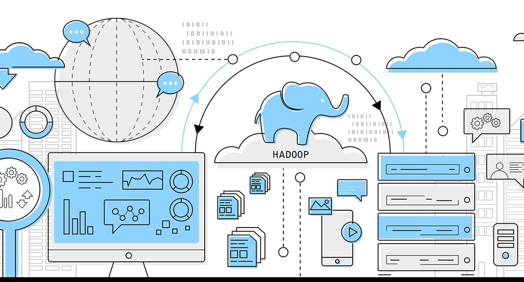

# What is Hadoop and Why do we need it?

***"In pioneer days they used oxen for heavy pulling, and when one onx couldn't budge a log, they didn't try to grow a larger ox. We shouldn't be trying for bigger computers, but for more systems of computers." - Grace Hopper***

In a world we are looking for results in minutes instead of hours or days instead of months, our reliance on single computer networks for data processing can be naive. In this new age, it is better to divide the workload between computers, both in terms of time and cost.

If the reader has past history with computers, the idea of computer and network topologies is not new. In fact, they have been a prominent part of our network configurations (think back to Local Area Network (LAN) and Wide Area Networks (WAN) ). Although these ideas are a part of our daily life. They are limited in what the do. They provide simple network services which users use independently. But we are living in an age of Data and the amount of data flooded in the world every day is estimated, for 2020, to be around 44 zettabytes (4.4*10^22 bytes). In terms of magnitude, this is more than one disk drive for every person in the world.

**Some examples of heavy data generating are:**

i. The New York Stock Exchange (NYSE) generates around 4–5 terabytes of data per day.  
ii. Facebook hosts more than 240 billion photos growing at 7 petabytes per month.  
iii. The Internet Archive stores around 18.5 petabytes of data.  
iv. The Large Hadron Collider near Geneva, Switzerland, produces about 30 petabytes of data per year.  

Processing datasets such as these are not simple and provide many hurdles. for example:

1. Loading and writing the dataset can take hours if not minutes for processing.
2. When it comes to data visualization and processing it is an iterative process and can take a heavy toll on computers that do not have powerful (in turn expensive graphic cards).
3. This, in turn, leads to high electricity bills which should be as low as possible.

It is also a fact that companies rely heavily on an abundance of data instead of better algorithms. Therefore a distributed processing network decreases the cost and time spent. Especially at a time like this because if there's one good news, it's that Big Data is here. The bad news though is that we are struggling to store and analyze it.

These days, a  1 Terabyte drive is a normal part of our lives, but there are still some open disadvantages. First, the transfer speed is around 100 MB/s, so it takes more than 2 and a 1/2 hours to read all the data of the disk. Long time right? at big data reliant company, even worse. **But what if we had 100 drives, each holding one-hundredth of the data?** In a case such as this, working in parallel we could read the data in under 2 minutes

## What does Hadoop Do?
Working with parallel drives is risky since there are two important problems that can arise.  

**Hardware Failure**  
When the number of hardware components being used increases, so does the chance of one of them failing increases too. One possible step taken to prevent his from happening is by replicating the data which are known as redundant copies. In case of a failure in any components, a copy is available. In order to prevent hardware failure, the Hadoop Distributed Filesystem (HDFS) has built-in reliability that keeps backups available.

**Correctly, combining data from multiple sources.**  
Most analysis tasks need to be able to combine data at some point. in a distributed system, it is combining from other disks. A method such as MapReduce provides a programming model that abstracts the problem from disk reads and writes, transforming into a computation over sets of keys and values. This is a built-in part of the Hadoop platform.

Overall Hadoop provides:
- Reliability.
- Scalability.
- Functional with commodity hardware.
- It is an affordable open-source platform.

For this series, we will be diving into the bottom two layers.
- Data Storage (HDFS)
- Data Processing (Map Reduce, YARN)

## Resources

- https://datafloq.com/read/what-is-hadoop-and-five-reasons-organisations-use-/245
