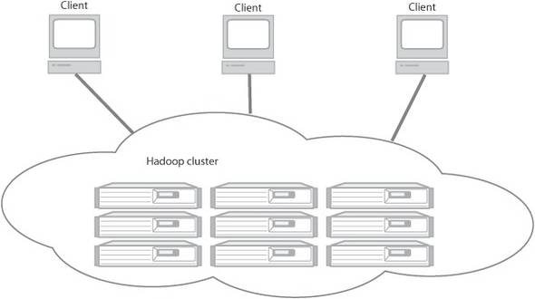

# What is Hadoop and Why do we need it?

***"In pioneer days they used oxen for heavy pulling, and when one onx couldn't budge a log, they didn't try to grow a larger ox. We shouldn't be trying for bigger computers, but for more systems of computers." - Grace Hopper***

In a world we are looking for results in minutes instead of hours or days instead of months, our reliance on single computer networks for data processing can be naive. In this new age, it is better to divide the workload between computers, both in terms of time and cost.

If the reader has past history with computers, the idea of computer and network topologies is not new. In fact, they have been a prominent part of our network configurations (think back to Local Area Network (LAN) and Wide Area Networks (WAN) ). Although these ideas are a part of our daily life. They are limited in what the do. They provide simple network services which users use independently. But we are living in an age of Data and the amount of data flooded in the world every day is estimated, for 2020, to be around 44 zettabytes (4.4*10^22 bytes). In terms of magnitude, this is more than one disk drive for every person in the world.

**Some examples of heavy data generating are:**

i. The New York Stock Exchange (NYSE) generates around 4–5 terabytes of data per day.  
ii. Facebook hosts more than 240 billion photos growing at 7 petabytes per month.  
iii. The Internet Archive stores around 18.5 petabytes of data.  
iv. The Large Hadron Collider near Geneva, Switzerland, produces about 30 petabytes of data per year.  

Processing datasets such as these are not simple and provide many hurdles. for example:

1. Loading and writing the dataset can take minutes if not hours for processing.

2. When it comes to data visualization and processing it is an iterative process and can take a heavy toll on computers that do not have powerful (in turn expensive graphic cards).
3. This, in turn, leads to high electricity bills which should be as low as possible.

It is also a fact that companies rely heavily on an abundance of data instead of better algorithms. Therefore a distributed processing network decreases the cost and time spent. Especially at a time like this because if there's one good news, it's that Big Data is here. The bad news though is that we are struggling to store and analyze it.

These days, a  1 Terabyte drive is a normal part of our lives, but there are still some open disadvantages. First, the transfer speed is around 100 MB/s, so it takes more than 2 and a 1/2 hours to read all the data of the disk. Long time right? at big data reliant company, even worse. **But what if we had 100 drives, each holding one-hundredth of the data?** In a case such as this, working in parallel we could read the data in under 2 minutes. This where the need for **Hadoop** arose.

## What does Hadoop Do?

 

Working with parallel drives is risky since there are two important problems that can arise.  

**Hardware Failure**  
When the number of hardware components being used increases, so does the chance of one of them failing increases too. One possible step taken to prevent his from happening is by replicating the data which are known as redundant copies. In case of a failure in any components, a copy is available. In order to prevent hardware failure, the Hadoop Distributed Filesystem (HDFS) has built-in reliability that keeps backups available.

**Correctly, combining data from multiple sources.**  
Most analysis tasks need to be able to combine data at some point. in a distributed system, it is combining from other disks. A method such as MapReduce provides a programming model that abstracts the problem from disk reads and writes, transforming into a computation over sets of keys and values. This is a built-in part of the Hadoop platform.

Overall Hadoop provides:
#### Accessiblility.
Hadoop runs on large clusters of commodity machines or on cloud computing services such as Amazon’s Elastic Compute Cloud (EC2).

#### Robustness.
Because it is intended to run on commodity hardware, Hadoop is architected with the assumption of frequent hardware malfunctions. It can gracefully handle most such failures.

#### Scalability.
Hadoop scales linearly to handle larger data by adding more nodes to the cluster.

#### Simplicity.
Hadoop allows users to quickly write efficient parallel code.
 
Hadoop, and large-scale distributed data processing in general has now become an improtant and necessary skillset for programmers. It's accessibility and simplicity give it an edge over writing and running large distributed programs.
**Note:** The good news is that even if you're a college student, we can quickly (and cheaply) create their own Hadoop Cluster.

## What is a node?
A node in hadoop simply means a computer that can be used for processing and storing. There are two types of nodes in hadoop Name node and Data node. It is called as a node as all these computers are interconnected.

**NameNode** is also known as the Master node. NameNode only stores the metadata of HDFS – the directory tree of all files in the file system, and tracks the files across the cluster. NameNode does not store the actual data or the dataset.The data itself is actually stored in the DataNodes. A functional filesystem has more than one DataNode, with data replicated across them.

## Case Studies

### New York Times
In 2007, The NYT decided to make all their public articles between 1851 and 1922 freely available on their website. This required a scalable image conversion system. It is important to note that most of the images from the older articles are scanned TIFF (**T**agged **I**mage **F**ile **F**ormat). For this they needed image processing to comibne different pieces of each article together into a single file in the desired PDF format. The Times could use a real-time approach to scale, glue and convert the TIFF images. The problem with a system such as this one is its inability to handly significant traffic increase (mainly due to the articles being free to view).

So, they decided to come up with a better solution. This solution involved pregenerating all the articles as PDF files and serve them like any other static concent. The times already has code to convert TIFF images to PDF files. Overall this looks very simple, *but* there is a catch. The **challenge** was that the archives has 11 million articles which approximated to ~ 4 Tera Bytes of Data.

The way NYT solved this problem was that one programmer at the times realized that this was an opportunity to use Amazon Web Services (AWS) and Hadoop. Storing and serving the final set of PDFs from Aamzons Simple Storage Service (S3) was a cost-effective approach rather than scaling up the storage back-end of the website. So, **Why not process the PDFs in the AWS cloud as well?**

The programmer copied 4TB of TIFF images into S3. By tweaking his code to fit within the Hadoop framework, the system was deplyed it do Hadoop running on 100 nodes in Amazon's Elastic Compute Cloud (EC2). 

The whole process took 24 hours and generated another 1.5 TB of data to be stored in S3. At 10 cents per instance per house, the whole job ended costing $240 (100 instances x 24 hours x $0.1) in computation (Independent of S3 Storage).

## Hadoop Ecosystem 
Overall even though the NYT had a huge database to work with, Hadoops distrbuted processing and Data Managment system simplified the process. By using distributed storage and transferring code instad of data, Hadoop avoids the costly transmission step when working with large data sets. More,over the redundancy of data allows Hadoop to recover a single node fail. Another equally important asset is that we donot have to worry about partisioning the data, determining which nodes will perform which task or handle communication between nodes. Hadoop handles all of this for us.

For the next articles, we will be diving into the bottom two layers.
- Data Storage (HDFS)
- Data Processing (Map Reduce, YARN)

## Resources

- https://datafloq.com/read/what-is-hadoop-and-five-reasons-organisations-use-/245
- Chuck Lam. 2010. Hadoop in Action (1st. ed.). Manning Publications Co., USA.
- Tom White. 2015. Hadoop: The Definitive Guide (4th. ed.). O’Reilly Media, Inc.
