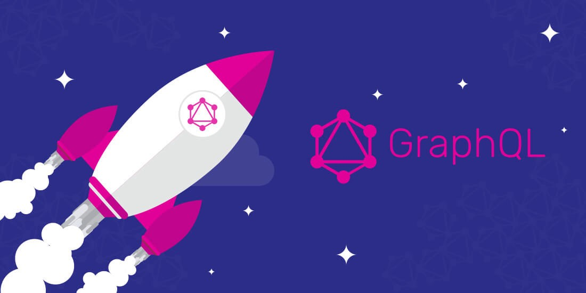

# What is GraphQL?

GraphQL is a query language for APIs. It is a syntax that describes how to get data from the server to the client. Compared to other query languages it prioritizes the client side. Clients can get exactly the data they asked for in the format they want.

GraphQL was first built by Facebook in 2012 before being open sourced and released to the public in 2015. Today, it’s used by lots of companies such as GitHub, Twitter, Airbnb, PayPal,and Yelp.


## Why GraphQL? 

Before GraphQL comes out, almost all web APIs are designed using REST. REST stands for “Representational State Transfer.”  It uses HTTP requests to `GET`, ` PUT`, ` POST`, and `DELETE` data. GraphQL can be seen as an alternative to REST. It solves some inefficiencies that developers experienced when using REST API. But how are they different?  Is GraphQL a replacement for REST? Which one should you use?

### GraphQL vs REST API

#### Advantages of GraphQL

- **Data fetching**

  Data fetching is one of the most compelling advantages of GraphQL compared to REST API. With REST API, we might have to make several requests to multiple endpoints in order to get the data we want. However, we can get the desired data with only one query with GraphQL. For example, let’s say we are making a shopping mobile app. We want to access the price of the item, the last 10 customer reviews, and 10 similar items. With REST, we might need 3 requests to get the data. We need to first access the endpoint `/item/<id>` to get the price. Then we might have to hint the `/item/<id>/reviews`  endpoint to get a list of all the reviews. After that, we can do`/item/<id>/similaritem` to get all the similar items. If we are using GraphQL we probably only need to send the following in a single query.

  ```json
  query{
    item (id:"12se34gkm5"){
      price
      reviews (last:10){
        message
      }
      similaritem(first:10){
        id
      }
    }
  }
  
  ```

  The data we get from the server with these two ways are different actually. This is when overfetching and underfetching come into play. 

  **Overfectching** means the client gets more data than they actually want. Take  `/item/<id>/reviews` as an example, we will receive a list of all the reviews. Each review might include author, message, rating, date, and other fields that we are not going to use.

  **Underfetching** is not getting all the information with a single call to the endpoint. In this case, we need to make additional calls to access all the required data. This usually happens when a client wants to get specific fields of a list of items. For example, we want to get the prices of all the similar items. we have to first  access `/item/<id>/similaritem` , then we need to do `/item/<id>` for each similar item. While in GraphQL  we only need one request with the use of variables.

  Both overfectching and unerfectching are considered as performance issues of REST API. As you scale up or iterate your project these issues would become a problem. GraphQL fixs the issues as it allows the client to specify the data needed and will only give needed data back to the client. Thus, GraphQL is more flexible and efficient in data fetching compared to REST API.

- **Version**

  When you release a new version of your API, your server needs to support both versions. However, REST doesn't have a clear defined approach to support versioning. Developers have to comes up with their own way of doing it. GraphQL has made versioning much simpler. You just need to add new fields to your schema. and that's it. You don't have to modify your code for the old version.

- **Schema & Type system**

  Different from REST, GraphQL uses a type system to define the capabilities of the APIs. All the types that are used in the API are defined in a schema and each type describes a set of fields. Since it's a type system, it can catch the errors you might make before executing a query and it can automatically generate the documenting for you. There are also tools like [GraphQL Code Generator](https://graphql-code-generator.com/) and [Apollo]( https://www.apollographql.com/) that can make your life much easier.

  Besides, once the schema is defined, frontend and backend developers can work on their own. This will definitely save a lot of time on communication.

  

#### Disadvantages

Although GraphQL reduces the complexity of changing data on the client side, it requires more server computing power that may burden serverside. Also, having a good schema design, and schema management could be a hard thing when your team gets larger.

### When to use GraphQL?

- When you need to retrieve data from multiple places into your API.
- When you want to add more functionality to your API.
- When you need rapid prototyping.
- When you are developing both frontend and backend.


## Conclusion

GraphQL is a new technology that is really powerful in building APIs. It provides clients with lots of flexibility. On the other hand, REST APIs have a proven record of performance for the past several years. If you already have a project in REST, it might be difficult to switch to GraphQL. But you can always use GraphQL and REST simultaneously to get the best performance.

GraphQL might seem complex at first and might take you some extra time to learn. But I believe it’s worth learning, as more and more companies and frameworks are adopting it and it’s becoming more popular. 

If you want to learn more about GraphQL, here are some resources that you might find helpful:

[How to GraphQL - The Fullstack Tutorial for GraphQL](https://www.howtographql.com/)

[Visit the official website of GraphQL](https://graphql.org/)

[Get the GraphQL specification](https://github.com/graphql/graphql-spec) 
