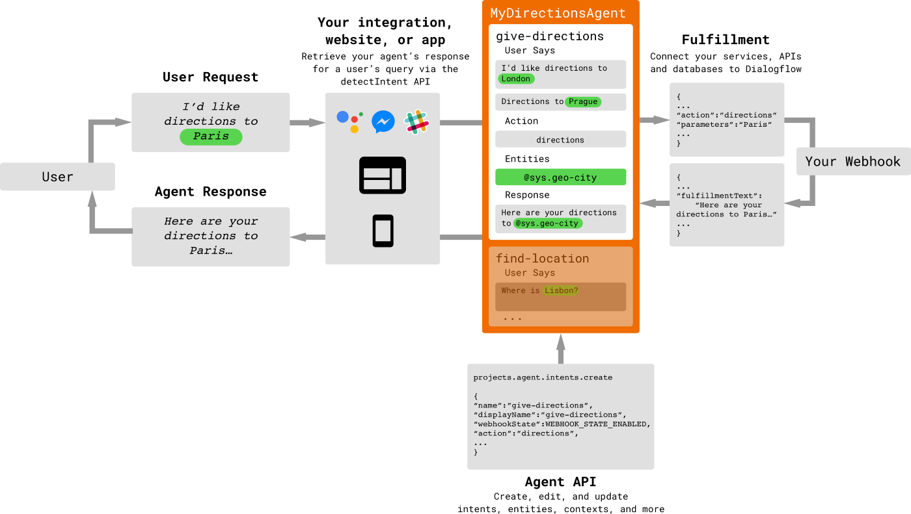
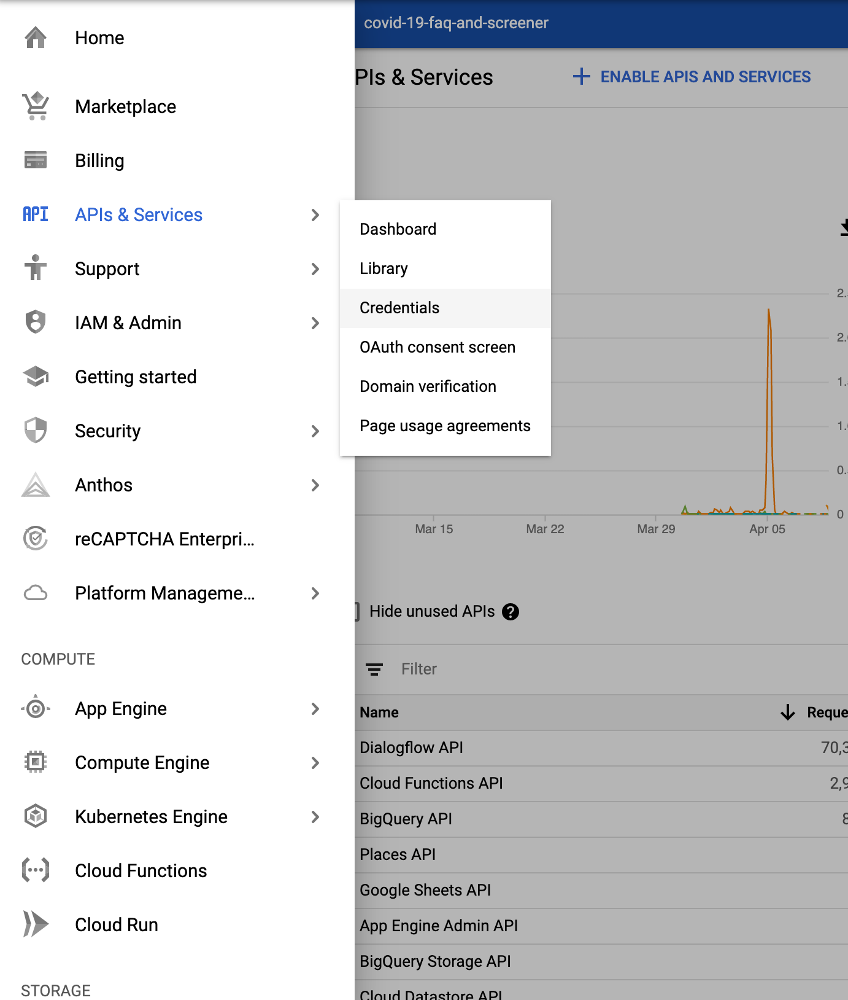
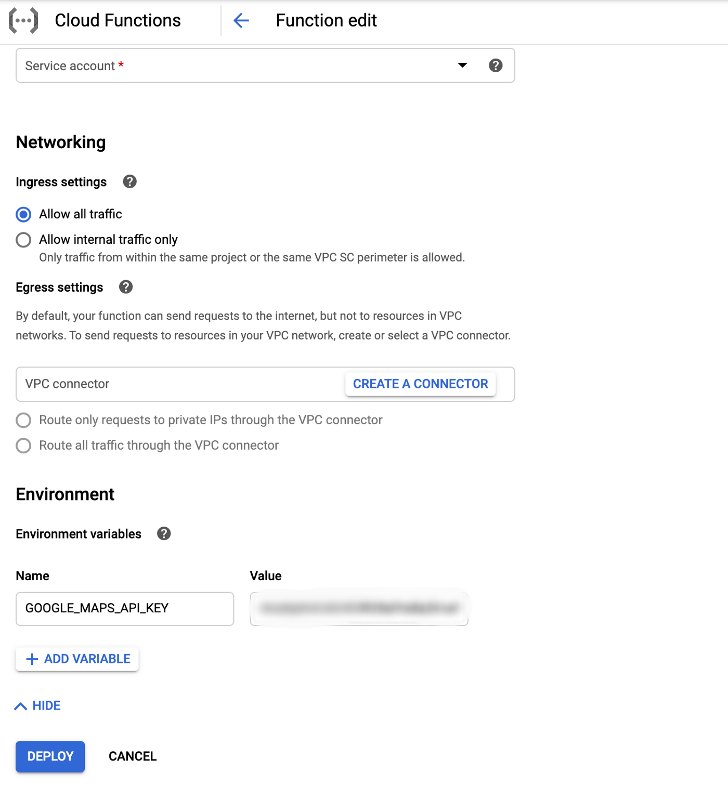
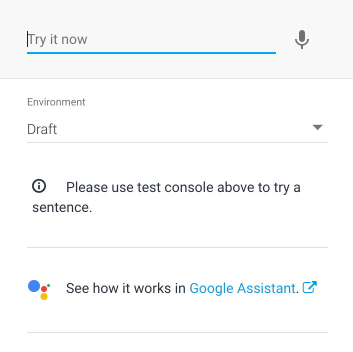
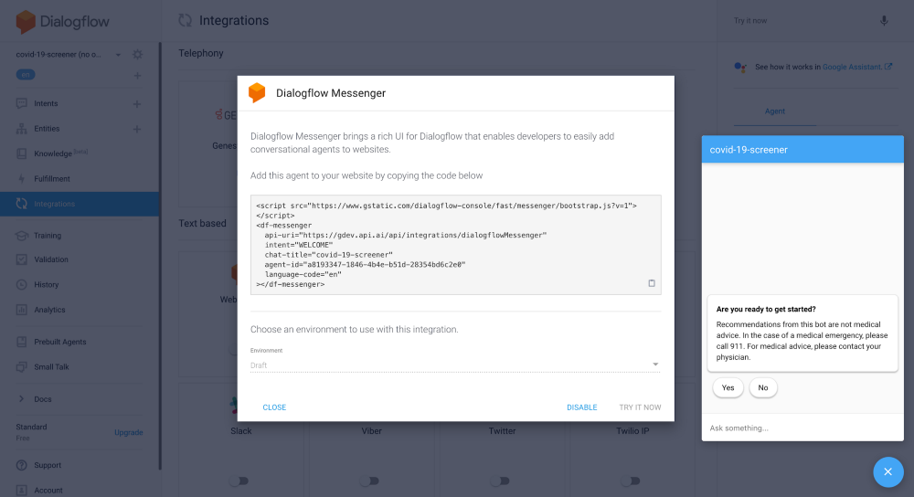

# Covid-19 and ChatBots


## What is a Chatbot?

A Chatbot is a software that you can “chat with”. You can find Chatbots in messaging apps such as Facebook Messenger, or on websites through pop-ups. They can also be integrated with “virtual assistants” for customer service or tech support. Google Assistant, Amazon Alexa are both great examples.

With the rapid improvements in Natural Language Processing (NLP) it has never been easier to create a chatbot. If you pay more attention to the structures of modern websites. You will notice that most of them have an existing chatbot integrated with the web pages. These bots are smart chatbots as they have the ability to understand language structures. Although limited in general, they provide all the necessary components needed from a virtual assistant if you needed help navigating through a website. So how easy is it to create a chatbot.

First, let’s look into what our need for a chatbot might be:

- **Navigation:** You want to help a user navigate through a website.
- I**nformation:** Searching for news relevant to you.
- **Customer Assistance:** Your business requires heavy customer assistance and it would be easy to automate response to complaints that do not require urgent attention.
- **Social-Automation:** Automate restaurant reservations.
- **Curiosity:** You just want to explore the limits of computer intelligence (or trickery, observe the image ⬇️)


## Why are Chatbots important for business?

There are a massive amount of active users online these days. Chatbots make it much easier to offer customer service. Chatbots can interact with multiple users at the same time and work 24 hours a day. They provide users with helpful information to enhance customer experience and boost the conversation rate. At the same time, they reduce the cost of traditional customer service and free up your team from answering the same FAQs.

As you can see the opportunities regarding what to do with a chatbot are limitless. Therefore, let's start from where the researchers and pioneers of Natural language understanding (NLU) started. **Curiosity**.

For this example, we will be using Googles **DialogFlow**

## **What is Google Dialogflow?**

DialogFlow is a powerful NLU Api that was acquired and is now developed by Google. It gives users new ways to interact with your product by building engaging voice and text-based conversational interfaces, such as voice apps and chatbots, powered by AI. Connect with users on your website, mobile app, the Google Assistant, Amazon Alexa, Facebook Messenger, and other popular platforms and devices.

What makes Dialog Flow good and popular:

- powered by Google’s Machine Learning
- Built on Google infrastructure
- Optimized for the Google Assistant
- It is very user friendly, intuitive and is one of the best NLP models out there.

## Building Blocks

**Agent:**
DialogFlow allows you to make Natural language understanding (NLU) modules, called agents. It is the main component of our bot. It connects to your backend and provides it with your custom logic. It’s made up of intents, but what are intents?

**Intent:**
Intents are simply actions that a user can perform on your agent. You can set up as many intents as you want for your agent. When a user says something Dialog Flow will match the expression with one of the intents that you created. For example, you may have a “Shipping” intent. When a user asks “what are the shipping methods?“, the chatbot will match it with the “Shipping” intent. However, how does the chatbot know which intent to call? It uses entities.

**Entity:**
Entity maps what a user says to what action should be taken. Any information that is critical to your business logic, will be an entity. This includes stuff like dates, email addresses, and any other keyword categories that users may talk about. For example, “order number” can be an entity, it will get called when a user enters an order number. This entity can be linked to an “Order” intent which can deal with all the possible problems for an order.




So let's use this information into and turn in to something practical. For this tutorial, we will be walking you through on how to create a ChatBot that fetches **COVID-19** information from all around the world

# Steps:

## Download the template files

From GitHub, download the [Verily COVID-19 Pathfinder virtual agent template](https://github.com/GoogleCloudPlatform/covid19-rapid-response-demo/blob/master/agent-template/covid-19-agent-template.zip) and its associated [fulfillment code](https://github.com/GoogleCloudPlatform/covid19-rapid-response-demo/blob/master/agent-template/dialogflow-fulfillment.zip).

## Create an Agent:

1. Go to the [Dialogflow Console](https://dialogflow.cloud.google.com/).
2. If requested, sign in to the Dialogflow console. See [DialogFlow console overview](https://cloud.google.com/dialogflow/docs/console) for more information.
3. Click **Create Agent** on the left menu. (If you already have other agents, click the agent name, scroll to the bottom and click **Create new agent**.)
4. Enter your agent’s name, default language, default time zone, and GCP project, then click the **Create** button. (You can change the [agent edition and pricing plan](https://cloud.google.com/dialogflow/docs/editions) after creation.)

- Click the settings button.
- Select the **Export and Import** tab, then click the **Import from Zip** button to [import the template](https://cloud.google.com/dialogflow/docs/agents-settings#export) you downloaded above.

## Enable and deploy fulfillment with the Inline Editor

To enable and deploy the default fulfillment code using the Inline Editor:

1. Click **Fulfillment** in the left sidebar.
2. Toggle the switch to [enable the Inline Editor](https://cloud.google.com/dialogflow/docs/fulfillment-inline-editor).
3. If you did not [enable billing in setup steps](https://cloud.google.com/dialogflow/docs/quick/setup#billing), you are prompted to enable billing now. Cloud Functions have associated charges, but the service is free up to a [significant number of monthly invocations](https://cloud.google.com/functions/pricing).
4. Click **Deploy** at the bottom of the form and wait until dialogs indicate that it has been deployed.


- Go to the Google Cloud Console and select Cloud Functions on the left panel.

1. Select the fulfillment for the function you created and click the **Edit** button.

2. Under the **Source code** section, select **ZIP upload** and upload the fulfillment zip file you downloaded above. Select a Stage bucket (you may need to create one if it hasn’t been created yet).

3. Follow the instructions in the Google Maps Platform [quickstart](https://developers.google.com/maps/gmp-get-started?&_ga=2.151893690.2050009114.1588390420-45888550.1587369863#quickstart) to enable the Google Maps **Places API**. Select **API & Services > Credentials** in the console to create an API key for calling the Places API (See [Get an API Key](https://developers.google.com/places/web-service/get-api-key) for more information).

   


5. Set the `GOOGLE_MAPS_API_KEY` environment variable to the provided API key. See [Updating environment variables](https://cloud.google.com/functions/docs/env-var#updating_environment_variables) for more information.




6. To use metrics for COVID-19, [enable the BigQuery API](https://console.cloud.google.com/flows/enableapi?apiid=bigquery) by selecting your project and agreeing to the terms of service.

# Interacting with your agent

## Using the Dialogflow Console Simulator




1. Type your text query input in the [Dialogflow Simulator](https://cloud.google.com/dialogflow/docs/console#simulator).

**Note: The custom payload of responses may not show up on the Dialogflow Console.**





## Using Dialogflow Messenger

1. Go to the [Dialogflow Console](https://dialogflow.cloud.google.com/).
2. Select your agent.
3. Click **Integrations** in the left sidebar menu.
4. Enable the [**Dialogflow Messenger**](https://cloud.google.com/dialogflow/docs/integrations/dialogflow-messenger) integration.
5. Paste the embed code shown on the dialog in a webpage on your website. To interact with the agent on your site, click the icon at the bottom right, type your input query, and press Enter. The agent responds.
6. [Customize the agent](https://cloud.google.com/dialogflow/docs/integrations/dialogflow-messenger#html_customizations) to appear the way you want it.

# Using the Dialogflow API

To interact with your agent using the Dialogflow API, ensure that your Google Cloud Platform project is properly [set up](https://cloud.google.com/dialogflow/docs/quick/setup), then submit a natural language query about COVID-19 and detect its intent.

1. Create a request.json file that includes a natural language query about COVID-19. For example:

   ```json
    {
      "query_input": {
         "text": {
             "text": "how to get tested",
             "language_code": "en-US"
           }
        }
      }
   
   // See the detectIntent page for details about the JSON format.
   // page: https://cloud.google.com/dialogflow/docs/reference/rest/v2/projects.agent.sessions/detectIntent#request-body
   ```

<iframe src="https://medium.com/media/2732022c337c912f61e95a2781ebaf99" allowfullscreen="" frameborder="0" height="300" width="680" title="request.json" class="s t u dq ai" scrolling="auto" style="box-sizing: inherit; position: absolute; top: 0px; left: 0px; width: 680px; height: 299.984px;"></iframe>

2. Run the following command to send a detect intent request to your agent.

```json
curl -X POST 

        -H "Authorization: Bearer "$(gcloud auth application-default print-access-token) 

        -H "Content-Type: application/json; charset=utf-8" 

        -d @request.json 

        https://dialogflow.googleapis.com/v2/projects/project-id/agent/sessions/session-id:detectIntent
```

**Note:** There are many [other ways](https://cloud.google.com/dialogflow/docs/quick/api#detect_intent) (C#, Go, Java, Python, Node.js, PHP, Ruby, etc) to interact with the API.