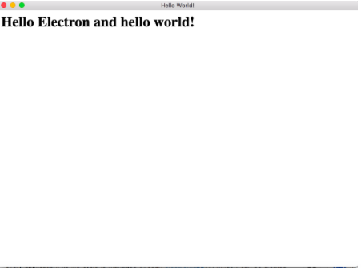
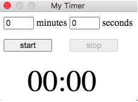
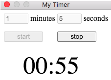
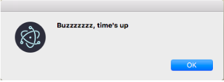

# Build Your First Desktop Application with Electron
Chen Meng </br>
May 19, 2020

**Objective:**
This guide introduces Electron and will help you develop your first Electron application.

**Audience:** 
This guide targets people interested in Electron but have little to no experience with it. It is recommended that readers have some experience in html, css and javascript since knowing them is very essential to build an Electron application.

## What is Electron?
Electron is a framework for creating cross-platform desktop applications with web programming languages like html, css, and javascript. By cross-platform, it means that you can build and deploy your application on all major operating systems(OS) including Windows, Linux, and MacOS with the same source code. The reason why you don’t have to adapt your program to different operating systems is that Electron runs your code in a Chromium environment independent of your OS. So, let’s jump into our first Electron app!

## Get Started: Hello World Application!
Of course, the easiest and simplest way to learn a new technology is to create a hello world project of your own, so we are going to build one.

### Prerequisite: Installation and Setup
Before diving into our hello world application, make sure you have node.js installed on your computer. node.js is a javascript runtime environment that can execute javascript code outside of a web browser, and Electron also uses it to run your javascript code.

An Electron application is essentially a node.js application, so the first step is to create a node project. Open your command line client and create a new folder to store your project, and in that folder, run:

```
npm init
```

npm will guide you to create a basic package.json file, in the end it might look like this:
```javascript
{
  "name": "Hello World",
  "version": "1.0.0",
  "main": "main.js",
  "scripts": {
    "test": "echo \"Error: no test specified\" && exit 1"
  },
  "author": "your-name",
}
```

Make sure you remember the main field, since it directs to the file being executed when the program starts. In this case, the main field directs to file main.js.

Next, we need to add a start script as instruction for Electron to execute current package:
```javascript
{
  "name": "Hello World",
  "version": "1.0.0",
  "main": "main.js",
  "scripts": {
    "start": "electron ."
  },
  "author": "my-name",
}
```

With package.json configured, we have to install Electron into our project. It is recommended to install it as a development dependency:
```
npm install --save-dev electron
```

### Writing Our Hello World App
First let’s look into main.js, the entry portal into our hello world application. For Electron, all of its APIs and features can be accessed via the electron module by using the require() function, just like every node module:
```javascript
const electron = require('electron')
```

The require function stores all of Electron’s features into the variable electron as namespaces, and each feature can be accessed via calling electron.feature_name. For every application, its life cycle is managed through electron.app. A window can be created using the electron.BrowserWindow class. We can access the features by calling:
```javascript
const app = electron.app;
const BrowserWindow = electron.BrowserWindow;
```

Or alternatively:
```javascript
const { app, BrowserWindow } = require('electron');
```

For our hello world application, a simple main.js file can wait for app to be ready and then open a BrowserWindow, which then loads an html file as the main UI:
```javascript
const { app, BrowserWindow } = require('electron');
function createWindow() {
    // Create the browser window.
    win = new BrowserWindow({
        // Set options for the window
        width: 800,
        height: 600,
        webPreferences: {
            nodeIntegration: true
        }
    })
    // BrowserWindow will load index.html upon creation
    win.loadFile('index.html')
}
// BrowserWindow is created when app is ready
app.whenReady().then(createWindow)
```

Finally, we write a simple index.html to display our hello world page:
```html
<html>
  <head>
    <meta charset="UTF-8">
    <title>Hello World!</title>
    <meta http-equiv="Content-Security-Policy" content="script-src 'self' 'unsafe-inline';" />
  </head>
  <body>
    <h1>Hello Electron and hello world!</h1> 
  </body>
</html>
```
### Running Your Application
After finishing our hello world project, it’s time to run it! To run, simply type this command. It will execute the “electron .” command we have set in package.json.
```
npm start
```
</br>
A window will show up in your computer: </br>


Watching the window show up is very exciting! yet … a bit boring. So, why not create a more interesting program?

## What Electron Can Do: Build A More Complicated Application

For a more complicated application, we are going to build a small timer widget that lives on the top corner of the screen. The source code can be found in this Github repo.

### Step1: Start With the UI

First, let’s build a basic UI for the timer in index.html. It should have two input fields, one for minutes and the other for seconds. It should also have two buttons to start and stop the timer, and a text field to display the timer:
```html
<body>
  <div class="container">
    <ul> <!-- Input fields-->
      <li> <input type="text" id="minutes" value="0"> </li>
      <li> minutes</li>
      <li> <input type="text" id="seconds" value="0"> </li>
      <li> seconds</li>
    </ul>
    <ul> <!-- Buttons -->
      <li> <button id="startBtn"> start </button> </li>
      <li> <button id="stopBtn" style="margin-left: 25px"> 
            stop </button> </li>
    </ul>
    <!-- Display field -->
    <p id="display">00:00</p>
  </div>
  <!-- Link to the body of the timer -->
  <script> require('./timer.js') </script>
</body>
```

Then, we can add some styles to the fields and buttons to rearrange them. This is a very basic UI, feel free to make it look nicer:
```css
ul{ padding-left: 0px; }
li { display: inline; }
input { width: 50px; }
button { width: 80px; }
#display{
    font-size: 50px;
    margin-top: 20px;
    margin-bottom: 20px;
    margin-left: 40px;
}
.container{ width: 300px; }
```

### Step2: Implement the Body of the Timer
The next step is to implement the body of the timer in timer.js, which contains the button listeners to start and stop the timer. It also has the timer function which counts down and update the UI accordingly:

```javascript
// dialog is used to show message box in the app
const { dialog } = require('electron').remote;
// Input fields and display fields
var minutesField = document.getElementById('minutes');
var secondsField = document.getElementById('seconds');
var display = document.getElementById('display');
var myTimer; // Stores the timer used to count time

// Start Button
const startBtn = document.getElementById('startBtn');
startBtn.addEventListener('click', function(){
    minutes = parseInt(minutesField.value, 10);
    seconds = parseInt(secondsField.value, 10);
    // Check for valid inputs, if not valid then timer won't start
    if(minutes >= 0 && minutes <= 59 && seconds >=0 && seconds <=59){
        minutesField.disabled = true;
        secondsField.disabled = true;
        startBtn.disabled = true;
        stopBtn.disabled = false;
        var timer = minutes*60 + seconds;
        // Start timer
        myTimer = startTimer(timer, display);
    }
});
const stopBtn = document.getElementById('stopBtn');
// Disabled at first
stopBtn.disabled = true;
stopBtn.addEventListener('click', function(){
    clearInterval(myTimer);
    clearTimer();
});
// Function to start the timer
function startTimer(time, display) {
    const timer = setInterval(function () {
        minutes = Math.floor(time/60);
        seconds = time%60;
        minutes = minutes < 10 ? "0" + minutes : minutes;
        seconds = seconds < 10 ? "0" + seconds : seconds;

        display.textContent = minutes + ":" + seconds;
        // Time's up when time == -1
        if (--time < 0) {
            dialog.showMessageBox({
                title: "Time's Up!",
                message: "Buzzzzzzz, time's up!"
            });
            clearTimer();
            clearInterval(timer);
        }
    }, 1000); //set the interval to 1000ms (1s), function body is executed once per second
    return timer;
}

//Resets the fields and buttons
function clearTimer(){
    display.textContent = "00:00";
    minutesField.value = "0";
    secondsField.value = "0";
    startBtn.disabled = false;
    stopBtn.disabled = true;
    minutesField.disabled = false;
    secondsField.disabled = false;
}
```

### Step3: Configure the Electron Window
The last step is to configure main.js, the entry portal of the program:

```javascript
const { app, BrowserWindow } = require('electron')

function createWindow() {
    // Create the browser window.
    win = new BrowserWindow({
        // Dimension of the window
        width: 230,
        height: 170,
        // Starting position of the window on screen: topleft
        x: 0,
        y: 0,
        // Window is not resizable, minimizable, or maximizable
        resizable: false,
        minimizable: false,
        maximizable: false,
        webPreferences: {
            nodeIntegration: true
        }
    })
    // Load index.html upon creation
    win.loadFile('index.html')
}
app.whenReady().then(createWindow)
```

With index.html, timer.js, and main.js ready, our timer app is good to go! Let’s run it and see how it behaves.

Step 4: Play With It
By running npm start, this window should pop up on the top left corner on your screen. It has two text input fields for entering desired minutes and seconds. </br>
 </br>
We can set a countdown for 1 minute and 5 seconds, then press the start button. The countdown begins.
 </br>
After counting down to 0, the alert message shows up and the timer is reset. Our timer widget seems to work well!


## Conclusion

This guide should have given you an overview of how to build a simple cross-platform desktop application with Electron. If you have trouble following this guide, I suggest learning more about node.js before moving forward. Happy hacking!

Relevant Resources: </br>
Electron Official Beginner's Guide: https://www.electronjs.org/docs/tutorial/first-app </br>
Electron Official Documentation: https://www.electronjs.org/docs </br>
Electron APIs: https://www.electronjs.org/docs/api </br>
Node.js Introduction: https://nodejs.dev/learn </br>
