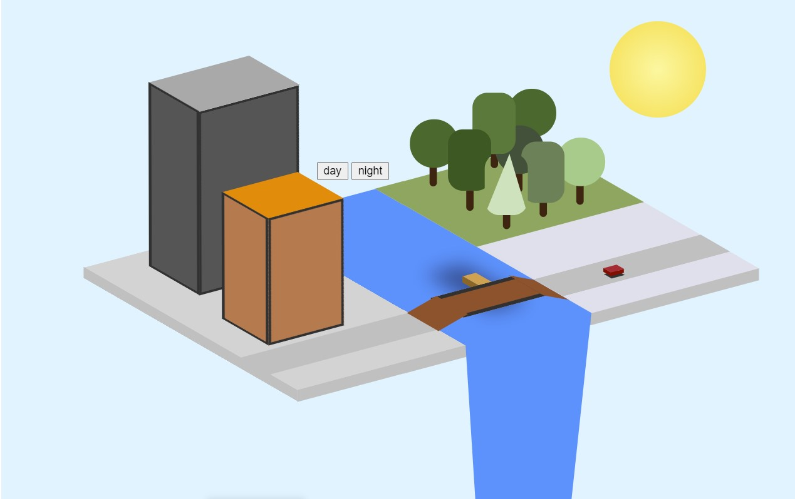
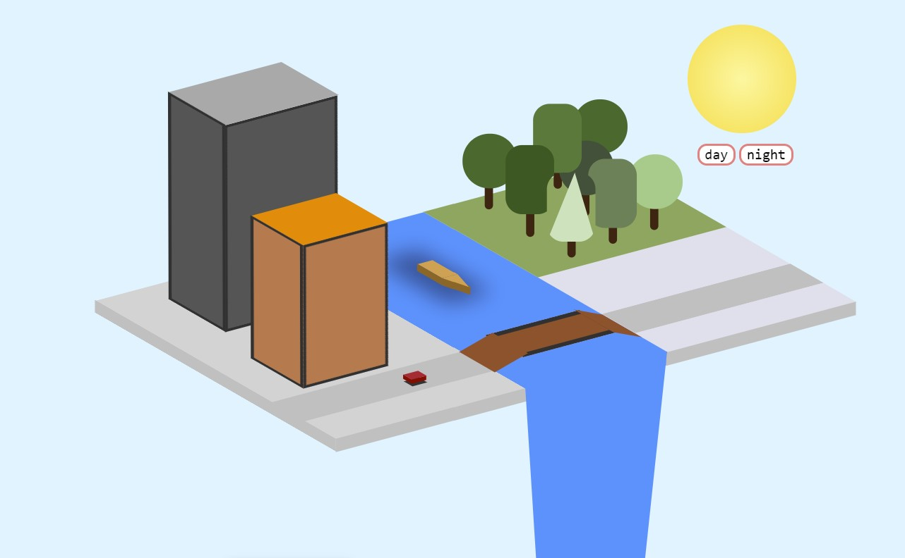
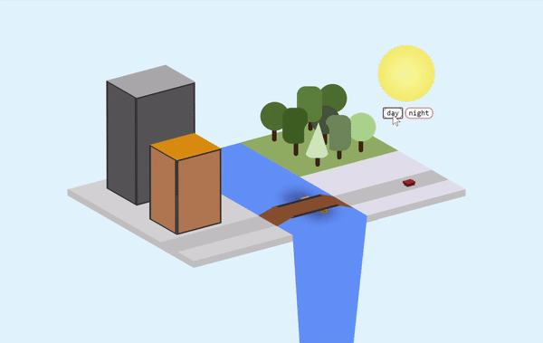

# From Day to Night - Creating Interactive Color Palettes with JavaScript

Now that you have completed setting up your Mini City in HTML and CSS, have you ever wondered what your Mini City would look like at night? Let's create a day-to-night color palette change by adding buttons with JavaScript! JavaScript is a programming language that is used to create interactive designs, such as buttons, pop-up windows, and so on, and brings user interaction to web development projects.

In this tutorial, you will learn how to do the following:

- Create buttons with HTML

- Stylize elements with CSS

- Add interactivity with JavaScript

  

## Setting Up Elements in HTML and CSS

### HTML Code

Before we start incorporating interactivity into our Mini City with JavaScript, we first need to set up these elements by adding to our HTML code. 

In order to switch from a daytime to nighttime color palette, we will create two clickable buttons, labelled "day" and "night", that will allow us to select the desired setting. To do this, we will add a set of `<button></button>` tags for each button in the `body` element:

```html
...
<!--HTML-->
  <body>
    <button>day</button>
    <button>night</button>
...
```

To prepare for our planned color changes, we need to assign an `id` attribute for each element that is involved, and this allows these elements to be stylized in CSS and manipulate in JavaScript. 

To  create a sun that can change into a moon for our Mini City, we will add a `<div>` element with an `id` named "sun". To change the color of the sky, we must access the `background-color` attribute of the `body` element, so we will set up an `id` named "body".  Add the following lines of code to the `body` element:

```html
...
<!--HTML-->
  <body>
    ....
    <div id = "sun"></div>   
    <body id = "body"></body>   
...
```

This is what our completed additions to the HTML code should look like:

```html
...
<!--HTML-->
  <body>
    <button>day</button>
    <button>night</button>
      
    <div id = "sun"></div>   
    <body id = "body"></body>   
...
```

This is what our Tiny City should look like so far:


### CSS Code: Sun and Moon Elements

Now that we have set up our elements in HTML, we can start adjusting and stylizing them in CSS.

For our sun element, we will be adding a `#id` selector into our CSS code:

```html
...
<style TYPE="text/css">
    ...
    #sun {

    }
</style>
...
```

This kind of selector accesses the element that has the `id` listed after the hashtag, so whatever we add in this selector will affect the `sun` element, which we declared in our HTML code.

For our `#sun` selector, we will first create the shape and color of the sun using the following attributes:

```css
...
#sun {
    width: 115px;
    height: 115px;
    border-radius: 50%;
    background: radial-gradient(#FFF89E, #FFDE45);
}
...
```

With our `width` and `height` attributes having the same length, the default shape that will be created is a square. The `border-radius` attribute defines the radius of the sun's corners, and setting this attribute to 50% will create a perfect circle. Then, in the `background` attribute, we can determine the color of our sun by using the `radial-gradient` function, which creates a gradual transition of colors — the first declared color (light mellow yellow) will be the color at the center of the sun, and the second color (brighter warm yellow) will be the color along the edge of the sun.

Then, we will determine the location of the sun by adding the following attributes:

```css
...
#sun {
    ...
    position: absolute;
    left: 350px;
    bottom: 75px;
}
...
```

Similar to the other elements in our Tiny City, we will declaring the `absolute` value to the sun's `position` attribute, which allows the element to move along with the webpage's document body. The `left` attribute affects the element's horizontal position by pushing the sun more to the side, and `bottom` attribute affects the element's vertical position by lifting the sun upwards.

This is what our sun should look like in our Tiny City:



In preparation for our day-to-night change, we can also create our moon element by using the same code template we have for our `sun` element:

```css
...
#sun {
    ...
}

#moon {
    position: absolute;
    left: 350px;
    bottom: 75px;
    width: 115px;
    height: 115px;
    border-radius: 50%;
    background: radial-gradient(#D3D3D3, #555AA6);
}
...
```

For our moon, we will use a new selector labelled `#moon` and change the colors in the `radial-gradient` function — the color at the center of our moon will be a light cool gray, and the color at the edges will be a dark grayish violet.

At this point, we will not be able to view our moon element because we have not declared a `<div>` element for it in our HTML code. We do not need to declare this because will only be switching back and forth between these two selectors, which we will code in JavaScript later on.

This is what our completed `#sun` and `#moon` elements should look like:

```css
...
#sun {
    position: absolute;
    left: 350px;
    bottom: 75px;
    background: radial-gradient(#FFF89E, #FFDE45);
    width: 115px;
    height: 115px;
    border-radius: 50%;
}

#moon {
    position: absolute;
    left: 350px;
    bottom: 75px;
    width: 115px;
    height: 115px;
    border-radius: 50%;
    background: radial-gradient(#D3D3D3, #555AA6);
}
...
```

### CSS Code: Day and Night Buttons

To start stylizing our buttons' properties, we will be adding a `button` selector into our code:

```css
...
<style TYPE="text/css">
    ...
    button {

    }
</style>
...
```

This selector accesses all `<button>` elements declared in the HTML code, which are our `day` and `night` buttons.

First, we will adjust the color and position of our buttons with the following attributes:

```css
...
button {
	position: relative;
    top: -40px;
    right: -360px;
    background-color: #FFFFFF;
}
...
```

By setting the `position` attribute to `relative`, this will allow us to adjust the location of the buttons from their "normal" position, which is the center of the webpage, using the `top` and `right` attributes — the values that we inputted will move buttons to the area below our sun. We will also set the buttons' color to white using the `background-color` attribute.

Then, we will add a border to our buttons by adding the following attributes:

```css
...
button {
	...
    border-style: solid;
    border-width: 2px;
    border-color: #FF8080;
    border-radius: 10px;
}
...
```

For all the border properties to show up, the `border-style` attribute first must be set. Above, we set our buttons' borders to `solid` that will result in a solid colored border. Feel free to experiment with different kinds of borders from this [CSS Border Styles list](https://www.w3schools.com/css/css_border.asp). As for the additional border attributes, `border-width` and`border-color` adjust the border's thickness and color, respectively, and `border-radius` adjusts the roundness of the corners of the border — this particular property allows up to four values, each value accessing each corner of the element.

Finally, we will change the font of the text of our buttons with the last two following attributes:

```css
...
button {
	...
    font-size: 15px;
    font-family: "Consolas";
}
...
```

The `font-size` attribute will adjust the size of the buttons' font. Also, feel free to customize your buttons' font by testing out fonts from this [CSS font list](https://www.w3schools.com/cssref/css_websafe_fonts.asp) and setting it to your `font-family` attribute. You can also add additional attributes, such as `font-style` and `font-weight`, to stylize your buttons even more. 

This is what our completed `button` element should look like:

```css
...
button {
    position: relative;
    top: -40px;
    right: -360px;
    background-color: #FFFFFF;

    border-style: solid;
    border-width: 2px;
    border-color: #FF8080;
    border-radius: 10px;

    font-size: 15px;
    font-family: "Consolas";
}
...
```

This is what our Mini City should like so far:




## Adding Interactivity with JavaScript

### JavaScript Code

In order to be able to code in JavaScript in our HTML file, we will insert a set of `<script></script>` tags into the `body` element of our HTML code, underneath the code we added above:

```html
...
<!--HTML-->
  <body>
      <button>day</button>
      <button>night</button>
      
      <div id = "sun"></div>   
      <body id = "body"></body> 
    	
      <script>
	  </script>
...
```

If we want to manipulate the colors of the sun/moon element and the background, we must retrieve our `sun` and `body` elements, respectively, by calling on their `id`. 

To do this, we will declare a `var` or variable — `circle` for the `sun` element and `sky` for the `body` element — and then access each element by using the `document` method `getElementById()`:

```js
...
<script>
    var circle = document.getElementById("sun");
    var sky = document.getElementById("body");
</script>
...
```

Since we already established the `moon` element for our planned color palette change, we should also choose the color we want our night sky to be. 

To do this, we will create an array named `colors` that will contain the color of our daytime sky and nighttime sky:

```js
...
<script>
    var circle = document.getElementById("sun");
    var sky = document.getElementById("body");
    var colors = ["#D5F3FE","#343F8A"];
</script>
...
```

The first color in the array is our default daytime color, which is the light blue that we currently set, and the second color is for our nighttime color palette, which is a dark cool blue.

Now, to set up our day and night color palettes, we will set up two functions labelled `day` and `night`:

```js
...
<script>
    ...
    function day() {
        
      }
    function night() {
        
      }
</script>
...
```

For each function, we will need to establish two changes: one for our sun-to-moon switch, and another for our day-to-night color change.

To display our sun during the day and our moon at night, we will retrieve information from our `#sun` and `#moon` elements by using the `setAttribute()` method on our `circle` variable. For the two required parameters, we will set the `id` of this variable to the `sun` and `moon` elements for the day and night color palettes, respectively:

```js
...
function day() {
    circle.setAttribute("id", "sun");
}
function night() {
    circle.setAttribute("id", "moon");
}
...
```

To set our sky colors for the daytime and nighttime, we will accessing the `backgroundColor` attribute of the `body` element through our `sky` variable by appending `.style.backgroundColor` to retrieve and manipulate the CSS properties of this variable. Then, we will set this equal to its respective color of the day and night color palettes in our `colors` array (the index of an array always starts from the number `0`, so `colors[0]` is referring to the daytime color while `colors[1]` is referring to the nighttime color):

```js
...
function day() {
    circle.setAttribute("id", "sun");
    sky.style.backgroundColor = colors[0];
}
function night() {
    circle.setAttribute("id", "moon");
    sky.style.backgroundColor = colors[1];
}
...
```

This is what your completed JavaScript code should look like:

```js
...
<script>
    var circle = document.getElementById("sun");
    var sky = document.getElementById("body");
    var colors = ["#D5F3FE","#343F8A"];

    function day() {
        circle.setAttribute("id", "sun");
        sky.style.backgroundColor = colors[0];
      }
      function night() {
        circle.setAttribute("id", "moon");
        sky.style.backgroundColor = colors[1];
      }
</script>
...
```

To tie everything together, we need move back to our HTML code to link our `day()` and `night()` functions to our `day` and `night` buttons, respectively, by adding the `onclick` event to each button:

```html
...
<!--HTML-->
  <body>
    <button onclick = "day()">day</button>
    <button onclick = "night()">night</button>
...
```

Now, you can interact with your Mini City by changing the time of day through the click of a button:




## Conclusion

Congrats on adding an interactive color component to your Mini City!

Throughout this tutorial, we designed buttons in JavaScript and learned how to stylize and link these elements in HTML and CSS. 

Feel free to add more decorative features to your buttons or implement more actions under the day and night functions to create a more distinct switch between the changing times of the day. Though this blog series may only serve as a very simple introduction to these programming tools, hopefully, this project has sparked your interest and/or built your confidence in web development and design.