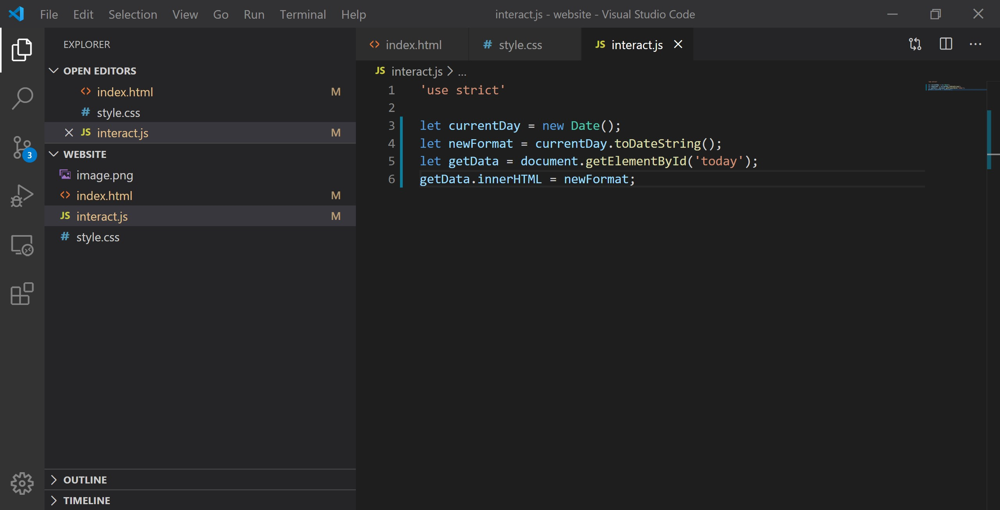

# How to Build Your Own Website - Introduction to HTML, CSS, and JavaScript

The world of web development and design is growing, and creating a website, whether it would be to display a design portfolio or to track personal progress in everyday life, has become a popular method to establish an online presence or to track personal progress. As the selection of website builders and frameworks continue to expand, however, it can seem daunting and overwhelming when you do not know where or how to start.

For those of you at square one, this blog will serve as your first step into the web development and design and teach you how to create a basic website entirely from scratch using HTML, CSS, and JavaScript.

In this tutorial, you will learn how to do the following:
- Setup your coding editor

- Code HTML, CSS, and JavaScript files

- Run a functional basic website

  

## Coding Environment

### Getting Started
We will be using [Visual Studio Code](https://code.visualstudio.com/) as our *source code editor*, which is a text editor that is specialized for writing computer programs, for creating the files for our website. In order to get started, [download Visual Studio Code](https://code.visualstudio.com/download) and install the right version for your computer.


## HTML, CSS, and JavaScript Files

To start, open your *terminal* or *command prompt*, which is a command line system on your operating that allows execute commands on your computer, and type the following:

```markdown
code index.html style.css script.js
```

This will automatically create, name, and open the three files you will need for you website in Visual Studio Code, then save each file by selecting **File > Save** and exit the app with **File > Exit**. Create a folder and move your files in to keep them all in one place (we named our folder "website"), and then in Visual Studio Code, go to **File > Open Folder** to open your folder and display your files.


### Building the Foundation: HTML File

*HTML* stands for Hypertext Markup Language and is the standard markup language for displaying content on a website. 

In your `index.html` file, type in the following code and save your file:

```html
<!DOCTYPE html>
<html>
  <head>
    <title></title>
  </head>
  <body>
  </body>
</html>
```

This is the basic underlying structure that behind all the websites you view online, and before we start editing our code, let us look over our code and understand what each part represents.

`<!DOCTYPE html>` indicates which version of HTML is being used, and in this case, we are using the latest version, HTML5.

HTML code is composed of *elements*, which are chunks of information stored between a set of opening and closing *tags*—for instance, `<html></html>` are the opening and closing tags for the `html` element. Think of these elements as separate boxes, which each indented element as a box within. 


To create the title of our website, add text between the `<title></title>` tags:

```html
...
  <head>
    <title>My Website</title>
  </head>
...
```

This title is important in a few ways, as it will appear in search engines, set the default name of your website when it is bookmarked, and allow you to more easily navigate this page of your website.

To add text to the body of page, we will use a heading tag `<h1></h1>` , which is can be ranked and numbered up to `<h6></h6>`, and a paragraph tag `<p></p>` between the opening and closing tags of the `body` element. Write whatever you would like to your web page between these tags:

```html
...
  <body>
      <h1>My Website</h1>
      <p>Hello World.</p>
      <p>This is my website.</p>
  </body>
...
```

If the text you wanted to add to the page has line breaks in between, you must up another `<p></p>` element because HTML will not change be able to detect and display the indents in your code onto your webpage.

To add an image to your web page, we will use an image tag `` which does not have a closing tag because it is a *void element*. The `` tag will include *attributes*, which can be added to the heading tag of an element to provide additional information, and the two attributes we will use as `src` and `alt`. The `src` attribute will contain the URL or name of the image, and in case the image does not load or cannot be viewed on the website, the `alt` attribute will display an alternative text message in replacement of the image. Add any image and text description you would like for your webpage:

```html
...
  <body>
      
      <h1>My Website</h1>
      <p>Hello world.</p>
      <p>This is my website.</p>
  </body>
...
```

Note that if you are using a local image on your computer, you must place the file in the same folder as the other files for your website.


Now, we can run the our website and see what it looks like so far. Go into your folder and double-click on your html file, which will prompt it to open in your web browser:


### Stylizing Content: CSS File

*CSS* stands for Cascading Style Sheets and is the standard style sheet language for defining and stylizing aspects on a website.

Before we can add anything to our CSS file, we need to link our CSS file in the HTML file by adding a `<link />` tag to the `head` element. The `<link />` uses a `ref` attribute that describes the relationship the HTML file has with the linked file and a `href` attribute that states the location or name of the linked file. Add the following line to the `head` element of your HTML file:

```html
...
  <head>
    <title>My Website</title>
    <link rel="stylesheet" href="style.css" />
  </head>
...
```

Now, to start stylizing our website, let us understand how CSS works.

A CSS file is called a stylesheet, and this stylesheet composed of *declaration blocks* that are defined by a *selector* and contain attributes between *curly brackets*. For our website, we will use an `img` selector for the image and a `body` selector for the text on the web page:

```css
img {
    
}

body {
    
}
```

For the `img` selector, we will add the `width` attribute, which will set the width of all images on our web page in pixels. Feel free to increase and decrease the number of pixels and run your website to see how the adjust how the image appears on the web page:

```css
img {
    width: 200px;    
}
...
```

For the `body` selector, we will first adjust the text on our page by adding the following attributes and values:

```css
...
body {
    font-family: helvetica;
    text-align: center;
}
```

Here, you can customize the font of the text on your website by selecting a value from this [CSS font list](https://www.w3schools.com/cssref/css_websafe_fonts.asp) and adding it to your `font-family` attribute. There are many other attributes you can add to your `body` selector to stylize the text on your website, such as `font-style`, `font-size`, `font-weight`, and so on. The `center` value for the `text-align` attribute will center whatever is listed inside the `body` element in your HTML file.

We can then add some color to our website by adding the following attributes:

```css
...
body {
    font-family: helvetica;
    text-align: center;
    
    background: aliceblue;
    color:  darkslategray;
}
```

Here, you can customize the color of your web page by using the `background` attribute and the color of your text by using the `color` attribute. Feel free to browse this [browser-supported colors list](https://www.w3schools.com/colors/colors_names.asp) and select any color you would like for your website. 

This is what your completed CSS file should look like:


Now, let us run our file again by double-clicking the HTML file in our folder and look at the stylizations we have made to add to our website:


### Adding Interactivity: JavaScript File

*JavaScript* is a programming language that in used in web development to add interactivity to websites through dynamic behavior, such as buttons, pop-up windows, and so on. For our website, we will add an element that displays today's date on our website.

Now before we start working on coding our JavaScript file,  we need to add an element to display our date, so we will add a set of `<p></p>` tags with an `id` attribute, which specifics a unique id for an HTML element that can be stylized by the CSS style sheet and/or manipulated by JavaScript, named `date`. We also need to link our JavaScript file in the HTML file by adding a set of `<script></script>` tags with a `src` attribute to our head element:

```html
...  
  <head>
    <title>My Website</title>
    <link rel="stylesheet" href="style.css" />
    <p id="date"></p>
    <script src="interact.js"></script>
  </head>
...
```

This is what your completed HTML file should look like:


Moving on to our JavaScript file, we will first activate *strict mode* for our website to narrow the possibility of assumptions JavaScript may make and prevent any possible silent errors that may occur:

```javascript
'use strict'
```

To display the current date, we will create a *variable* named `today` and use the built-in JavaScript *object* `new Date()` to retrieve the data we need:

```javascript
let today = new Date();
```

To format the data into the current date, we will create another variable named `formatDate` and use `toDateString()`, which will remove the time and time zone to only reveal the date:

```javascript
let formatDate = today.toDateString();
```

To add this data onto the website itself, we will create one more variable named `selectElement` to retrieve our `date` element from our HTML file by using `getElementById()` :

```javascript
let selectElement = document.getElementById('date');
```

Finally, after retrieving our `date` element, we need to insert the data we received into it by using `innerHTML` and setting it to our `formatDate` variable to finish our JavaScript code:

```javascript
'use strict'

let today = new Date();
let formatDate = today.toDateString();
let selectElement = document.getElementById('date');
selectElement.innerHTML = formatDate;
```

This is what your completed JavaScript file should look like:



Now, we have completely finished the code for our website!


## Conclusion

Congrats on creating your own website! 

From this blog, we discussed the basic components go into the structure of a website—HTML, CSS, and JavaScript—and built a solid foundation that will prepare you for diving deeper into the world of web development and design.

Feel free to continue adding more features to your website, such as photos, music, pages, and so on, by researching more about specific function you can create with HTML, CSS, and JavaScript, and by using this website as a base for future endeavors, you will be able to introduce and flesh out the complexity of your creations and eventually turn your interest in web development into a reality.